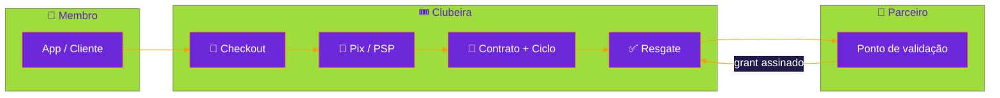
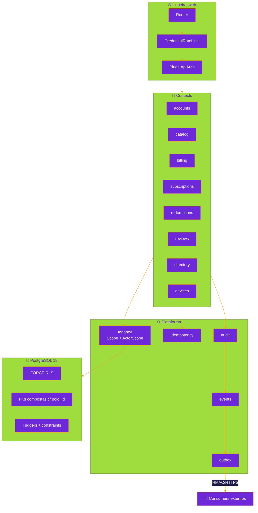
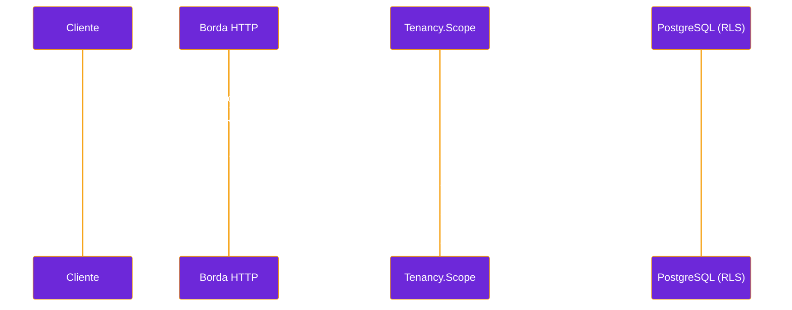
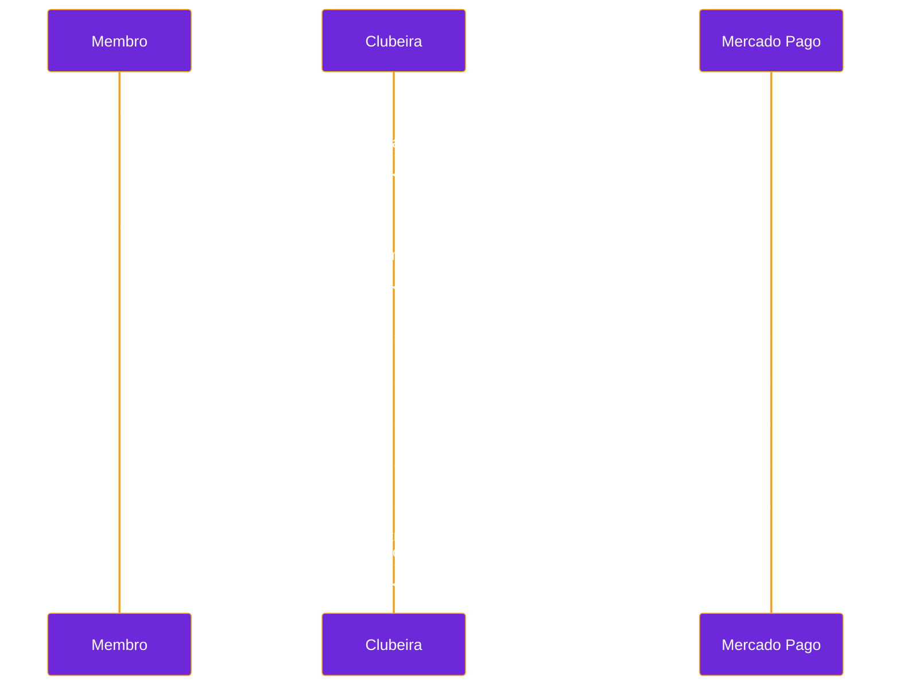
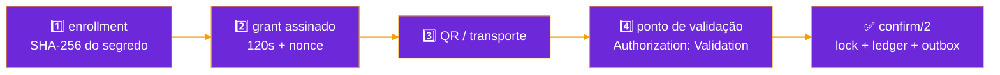

<div align="center">


[](https://elixir-lang.org/)
[](https://www.phoenixframework.org/)
[](https://www.postgresql.org/)
[](https://www.erlang.org/)
[](#-multi-tenancy)
[](./test)
[](./priv/repo/migrations)
[](./LICENSE)

**[🏗️ Arquitetura](docs/architecture.md)** · **[🛠️ Desenvolvimento](docs/development.md)** · **[🤝 Contribuir](CONTRIBUTING.md)** · **[🔐 Segurança](SECURITY.md)**

---

*"Um app, muitos polos. Um usuário, contratos independentes em cada um deles."*

</div>

---

> [!IMPORTANT]
> **RLS é defesa em profundidade, não autorização de negócio.**
> Nenhum `polo_id`, `user_id`, `device_id` ou `validation_point_id` vindo do
> cliente vale como prova de permissão. Toda operação tenant-aware entra num
> `Scope` já autorizado e roda dentro de `Repo.transact_in_polo/3`.

---

## 🎯 Visão geral

Clubeira é o backend de um SaaS multi-tenant para clubes de vouchers por
assinatura. Um único produto atende vários polos independentes — cidades,
regiões ou franquias — e o mesmo usuário mantém contratos, ciclos e benefícios
separados em cada um.



| Propriedade      | Valor                                                     |
|:-----------------|:----------------------------------------------------------|
| **Arquitetura**  | Monólito modular Elixir/Phoenix/Ecto                       |
| **Fonte de verdade** | PostgreSQL 18, schema único normalizado                |
| **Isolamento**   | `FORCE ROW LEVEL SECURITY` + FKs compostas com `polo_id`   |
| **Identidade**   | UUIDv7 em todas as entidades novas                         |
| **Consistência** | Invariante, auditoria, evento e outbox na mesma transação  |

---

## ✅ O que já funciona

| Domínio | Entregue |
|:--|:--|
| 🔐 **Identidade** | cadastro atômico com aceite da versão legal vigente, Argon2id, sessão bearer opaca e revogável, rate limit por global/IP/identidade |
| 🗺️ **Descoberta** | diretório público com perfil, contato, categorias e horários do parceiro, catálogo comercial e opções de checkout — tudo paginado por cursor |
| 🏪 **Parceiros** | onboarding administrativo idempotente e publicação autenticada do perfil operacional, ambos com auditoria, evento e outbox atômicos |
| 🛒 **Venda** | checkout idempotente, histórico paginado de pedidos, Pix via Mercado Pago com webhook HMAC que relê a order no PSP antes de liquidar |
| 🏦 **Recebimento** | contas globais vinculadas por vigência a cada polo, com integridade referencial entre tenant e conta |
| 📜 **Assinatura** | planos, contratos, ciclos e alocações de benefício independentes por polo |
| ✅ **Resgate** | enrollment sem persistir segredo, grant assinado e curto, provisionamento, rotação e revogação da credencial do ponto, consumo atômico com anti-replay, ledger, auditoria, evento e outbox |
| ⭐ **UGC** | avaliações verificadas por resgate, fila de moderação autorizada por polo, decisão append-only e feed público só do que foi publicado |
| 🧪 **Base** | 132 migrations, seeds determinísticas, factories, RLS forçado e testes de concorrência contra bancos isolados reais |

O fluxo de venda implementado no domínio é:

```text
checkout autenticado
  -> pedido aguardando pagamento
  -> captura autenticada pelo adaptador do provedor
  -> pagamento e pedido liquidado
  -> contrato e ciclo de benefício
  -> alocações de vouchers
```

A liquidação persiste esse resultado de forma atômica e aceita reprocessamento
seguro. A primeira borda real de PSP usa a Orders API do Mercado Pago para Pix;
payload bruto termina no adaptador e o core recebe somente uma captura
normalizada depois da assinatura e do estado remoto serem verificados. Cartão,
reembolso e chargeback continuam fatias separadas. A API online de resgate já
entrega o grant que um cliente pode renderizar como QR; placard estático,
operação offline e o componente visual de leitura continuam bordas próprias.

---

## ⚡ Subir o projeto

```bash
git clone git@github.com:gabrielmaialva33/clubeira.git && cd clubeira
mise install
mix setup
mix phx.server
```

`mix setup` instala as dependências, sobe PostgreSQL 18 em `127.0.0.1:55432`,
cria/migra o banco com a role de migration e carrega um cenário determinístico
com os polos **Sobral** e **Londrina**.

| Endereço | O que é |
|:--|:--|
| <http://localhost:4000> | aplicação |
| <http://localhost:4000/health> | health check |
| <http://localhost:4000/api/v1/polos/sobral/catalog> | catálogo demo |
| <http://localhost:4000/api/v1/polos/sobral/places> | parceiros do polo |
| <http://localhost:4000/api/v1/polos/sobral/checkout-options> | opções de checkout |
| <http://localhost:4000/dev/dashboard> | LiveDashboard (dev) |
| <http://localhost:4000/dev/mailbox> | caixa de e-mail local |

<details>
<summary><strong>📋 Pré-requisitos e credenciais do cenário demo</strong></summary>

| Ferramenta | Versão |
|:--|:--|
| Elixir | `1.20.2-otp-29` |
| Erlang/OTP | `29.0.5` |
| Docker + Compose | PostgreSQL `18.4` |
| Node | `26.2.0` |

As seeds criam `membro.demo@clubeira.local` com a senha local
`clubeira-demo-local`. Defina `CLUBEIRA_DEMO_PASSWORD` antes de `mix setup`
para trocar esse valor. O backoffice separa
`moderador.demo@clubeira.local` / `clubeira-moderador-local` de
`admin.demo@clubeira.local` / `clubeira-admin-local`; só o segundo pode
cadastrar parceiros. Sobral também recebe um ponto de validação cuja chave
local de demonstração é
`M-bCcLGupP8XuBxzemHd-4JumJf6trsiQpinEl30xwg`; substitua-a por 32 bytes
aleatórios em base64url sem padding via `CLUBEIRA_DEMO_VALIDATION_SECRET` em
qualquer ambiente compartilhado. Para testar o sandbox Pix, defina também
`CLUBEIRA_DEMO_EMAIL` com o e-mail do usuário de teste do Mercado Pago antes de
rodar as seeds. O mesmo membro possui contratos independentes em Sobral e
Londrina. Os três estabelecimentos demo já possuem perfil público completo,
com taxonomia curada, contato, semana de funcionamento e exceções de calendário.

</details>

---

## 🏗️ Arquitetura



<details>
<summary><strong>📋 Fronteiras de domínio</strong></summary>

| Módulo | Responsabilidade |
|:--|:--|
| `accounts` | usuários, credenciais, sessões, escopo do ator |
| `legal` | documentos versionados e aceites imutáveis |
| `polos` | tenants, políticas versionadas, memberships e roles |
| `directory` | cidades, organizações, marcas, endereços e lugares globais |
| `catalog` | acordos, ofertas, versões, janelas, blackouts e preços |
| `billing` | pedidos, intents, pagamentos e a borda do PSP |
| `subscriptions` | contratos, ciclos e carteira de alocações |
| `devices` | instalações autorizadas e grants assinados |
| `redemptions` | tentativas, resgates, ledger e anti-replay |
| `reviews` | avaliações verificadas, revisões e moderação |
| `tenancy` | `Scope`, `ActorScope` e as fronteiras transacionais |
| `idempotency` / `audit` / `events` / `outbox` | infraestrutura de confiabilidade |

</details>

---

## 🔐 Multi-tenancy

Um único schema PostgreSQL, compartilhado pelos polos e normalizado. Dados
tenant carregam `polo_id`; chaves estrangeiras compostas impedem referências
entre polos e todas as tabelas com `polo_id` são protegidas por RLS forçado.



| Camada | Mecanismo |
|:--|:--|
| **Integridade relacional** | FKs compostas com `polo_id`: uma linha de Sobral não referencia entidade de Londrina |
| **Escopo na aplicação** | `Tenancy.Scope` + `Repo.transact_in_polo/3` gravam polo/ator/request só durante a transação |
| **Defesa no banco** | `FORCE ROW LEVEL SECURITY` em toda relação tenant e em `outbox_messages` |
| **Role de runtime** | `clubeira_app` é `NOSUPERUSER NOBYPASSRLS`, sem DDL e sem ownership |

<details>
<summary><strong>📋 Roles, descoberta global e o resto dos detalhes</strong></summary>

Existem credenciais locais diferentes para cada responsabilidade:

- `clubeira_migrator`: dona do schema, usada apenas por migrations e seeds;
- `clubeira_app`: role de runtime `NOSUPERUSER NOBYPASSRLS`, sem permissão de
  DDL;
- `postgres`: administração local e testes; cada teste assume uma role
  temporária restrita antes de acessar os dados.

Autenticação é global: `POST /api/v1/auth/registrations` valida e normaliza o
email, exige todas as versões de termos vigentes publicadas por
`GET /api/v1/legal/registration`, e cria usuário ativo, aceite imutável, hash
Argon2id, sessão e auditoria na mesma transação.
`user_password_credentials` separa o segredo da identidade e `user_sessions`
persiste somente SHA-256 do bearer opaco. Recuperação de senha também usa 32
bytes aleatórios e grava apenas o digest em `user_password_reset_tokens`; o
token expira, é de uso único e uma nova solicitação revoga a anterior. O
consumo troca a credencial, revoga todas as sessões, consome o token e audita a
operação na mesma transação. Cadastro, login e as duas bordas de recuperação
têm limites locais por instância para tráfego global, IP e identidade, além de
um teto fail-fast para operações Argon2 concorrentes. Um limitador no ingress
continua obrigatório para impor o teto do cluster. Credenciais temporárias e
sessões terminais são removidas após a retenção configurada, 30 dias por padrão.

Cada requisição recebe um UUIDv7 interno em `x-request-id`, também usado para
correlacionar eventos globais de autenticação. Valores enviados pelo cliente
nesse header não viram identificadores da trilha forense. Para a tela
cross-polo, `user_contract_polo_routes` revela ao ator apenas os IDs dos polos
onde ele já contratou. Isso é um índice de roteamento, não uma autorização:
contrato, ciclo e saldo são relidos dentro da RLS de cada polo.

O endereço público de cada tenant fica na relação global 1:1 `polo_routes`.
Ela resolve apenas `slug -> polo_id`; depois disso, até a leitura pública do
catálogo entra numa transação com RLS e confirma que o polo está ativo. A
policy pública permite somente leitura das rotas; mutações continuam presas ao
`polo_id` ativo.

O catálogo aceita paginação por cursor com `?limit=20&after=...` (`20` por
padrão, máximo `100`) e devolve o próximo cursor em `meta.page.next_cursor`.
Ele publica o catálogo comercial vigente do polo; disponibilidade individual,
janelas e blackouts são regras da elegibilidade de resgate, não dessa vitrine
pública.

As contas de recebimento ficam em `merchant_accounts` e podem ser
compartilhadas entre polos. A relação normalizada `polo_merchant_accounts`
define quais contas cada polo pode usar, sua função e seu período de vigência.
Pagamentos, intents e eventos do provedor usam chaves compostas para impedir
que uma conta seja referenciada pelo tenant errado. O runtime lê apenas
vínculos vigentes do polo atual; mutações são reservadas à role dona do schema.

```sh
mix db.migrate  # sobe o container e migra com clubeira_migrator
mix db.reset    # recria o schema de desenvolvimento e reaplica as seeds
docker compose stop
```

`docker compose down` remove somente o container e a rede. O comando
`docker compose down -v` também apaga o volume e todos os dados locais.

</details>

---

## 🛰️ API

| Método | Rota | Auth |
|:--|:--|:--:|
| `GET` | `/api/v1/legal/registration` | 🌐 |
| `POST` | `/api/v1/auth/registrations` | 🌐 |
| `POST` | `/api/v1/auth/sessions` | 🌐 |
| `POST` | `/api/v1/auth/password-reset-requests` | 🌐 |
| `POST` | `/api/v1/auth/password-resets` | 🌐 |
| `DELETE` | `/api/v1/auth/session` | 🔑 |
| `GET` | `/api/v1/polos/:slug/catalog` | 🌐 |
| `GET` | `/api/v1/polos/:slug/checkout-options` | 🌐 |
| `GET` | `/api/v1/polos/:slug/places` | 🌐 |
| `GET` | `/api/v1/polos/:slug/places/:place_id/reviews` | 🌐 |
| `POST` | `/api/v1/polos/:slug/redemptions` | 🏪 |
| `POST` | `/api/v1/webhooks/mercado-pago/:merchant_account_id` | 🔏 |
| `GET` | `/api/v1/me/subscriptions` | 🔑 |
| `POST` | `/api/v1/polos/:slug/orders` | 🔑 |
| `POST` | `/api/v1/polos/:slug/orders/:order_id/payment-intents` | 🔑 |
| `GET` | `/api/v1/polos/:slug/me/orders` | 🔑 |
| `GET` | `/api/v1/polos/:slug/me/vouchers` | 🔑 |
| `POST` | `/api/v1/polos/:slug/me/redemption-devices` | 🔑 |
| `POST` | `/api/v1/polos/:slug/me/redemption-grants` | 🔑 |
| `GET` | `/api/v1/polos/:slug/me/redemptions` | 🔑 |
| `POST` | `/api/v1/polos/:slug/places/:place_id/reviews` | 🔑 |
| `POST` | `/api/v1/polos/:slug/backoffice/partners` | 🛡️ |
| `PUT` | `/api/v1/polos/:slug/backoffice/places/:place_id/profile` | 🛡️ |
| `POST` | `/api/v1/polos/:slug/backoffice/places/:place_id/validation-points` | 🛡️ |
| `POST` | `/api/v1/polos/:slug/backoffice/validation-credentials/:credential_id/rotations` | 🛡️ |
| `POST` | `/api/v1/polos/:slug/backoffice/validation-credentials/:credential_id/revocations` | 🛡️ |
| `GET` | `/api/v1/polos/:slug/backoffice/reviews` | 🛡️ |
| `POST` | `/api/v1/polos/:slug/backoffice/reviews/:review_id/moderation-actions` | 🛡️ |

🌐 público · 🔑 bearer do membro · 🏪 credencial do ponto de validação · 🔏 HMAC do PSP · 🛡️ membership de backoffice; cada rota relê sua capacidade no banco

<details>
<summary><strong>📋 Exemplos com <code>curl</code></strong></summary>

```sh
curl -sS 'http://localhost:4000/api/v1/legal/registration?locale=pt-BR'

curl -sS -X POST http://localhost:4000/api/v1/auth/registrations \
  -H 'content-type: application/json' \
  -d '{"email":"novo@example.test","password":"uma-senha-com-15-chars","legal_document_version_ids":["<legal_version_uuid>"]}'

curl -sS http://localhost:4000/api/v1/auth/sessions \
  -H 'content-type: application/json' \
  -d '{"email":"membro.demo@clubeira.local","password":"clubeira-demo-local"}'

curl -i -sS -X POST http://localhost:4000/api/v1/auth/password-reset-requests \
  -H 'content-type: application/json' \
  -d '{"email":"membro.demo@clubeira.local"}'

# Copie o token entregue em http://localhost:4000/dev/mailbox
curl -i -sS -X POST http://localhost:4000/api/v1/auth/password-resets \
  -H 'content-type: application/json' \
  -d '{"token":"<reset_token>","password":"uma-nova-senha-com-15-chars"}'

curl -sS http://localhost:4000/api/v1/me/subscriptions \
  -H "authorization: Bearer $TOKEN"

curl -sS -X POST http://localhost:4000/api/v1/polos/sobral/backoffice/partners \
  -H "authorization: Bearer $ADMIN_TOKEN" \
  -H 'idempotency-key: parceiro-sobral-001' \
  -H 'content-type: application/json' \
  -d '{"organization":{"legal_name":"Bistrô da Serra Ltda.","trade_name":"Bistrô da Serra","cnpj":"12.ABC.345/01DE-35"},"place":{"name":"Bistrô da Serra Centro","slug":"bistro-da-serra-centro","address":{"postal_code":"62010-000","street":"Rua das Flores","number":"42","district":"Centro"}}}'

curl -sS -X PUT \
  http://localhost:4000/api/v1/polos/sobral/backoffice/places/<place_uuid>/profile \
  -H "authorization: Bearer $ADMIN_TOKEN" \
  -H 'idempotency-key: perfil-bistro-sobral-001' \
  -H 'content-type: application/json' \
  -d '{"contact":{"email":"reservas@bistro.example","phone":"(88) 99999-0101"},"category_keys":["restaurant","regional-cuisine"],"weekly_hours":[{"weekday":1,"opens_at":"11:30","closes_at":"15:00"},{"weekday":1,"opens_at":"18:00","closes_at":"23:00"}],"special_hours":[{"date":"2026-12-25","kind":"closed"}]}'

VALIDATION_SECRET="$(openssl rand -base64 32 | tr '+/' '-_' | tr -d '=\n')"
VALIDATION_SECRET_SHA256="$(printf '%s=' "$VALIDATION_SECRET" | tr '_-' '/+' | openssl base64 -d -A | openssl dgst -sha256 -binary | openssl base64 -A | tr '+/' '-_' | tr -d '=\n')"
VALIDATION_EXPIRES_AT="$(date -u -d '+90 days' +%Y-%m-%dT%H:%M:%SZ)"

curl -sS -X POST \
  http://localhost:4000/api/v1/polos/sobral/backoffice/places/<place_uuid>/validation-points \
  -H "authorization: Bearer $ADMIN_TOKEN" \
  -H 'idempotency-key: caixa-bistro-sobral-001' \
  -H 'content-type: application/json' \
  -d "{\"name\":\"Caixa principal\",\"credential\":{\"secret_sha256\":\"$VALIDATION_SECRET_SHA256\",\"expires_at\":\"$VALIDATION_EXPIRES_AT\"}}"

NEXT_VALIDATION_SECRET="$(openssl rand -base64 32 | tr '+/' '-_' | tr -d '=\n')"
NEXT_VALIDATION_SECRET_SHA256="$(printf '%s=' "$NEXT_VALIDATION_SECRET" | tr '_-' '/+' | openssl base64 -d -A | openssl dgst -sha256 -binary | openssl base64 -A | tr '+/' '-_' | tr -d '=\n')"

curl -sS -X POST \
  http://localhost:4000/api/v1/polos/sobral/backoffice/validation-credentials/<current_credential_uuid>/rotations \
  -H "authorization: Bearer $ADMIN_TOKEN" \
  -H 'idempotency-key: rotacao-caixa-bistro-sobral-001' \
  -H 'content-type: application/json' \
  -d "{\"credential\":{\"secret_sha256\":\"$NEXT_VALIDATION_SECRET_SHA256\",\"expires_at\":\"$VALIDATION_EXPIRES_AT\"}}"

curl -sS -X POST \
  http://localhost:4000/api/v1/polos/sobral/backoffice/validation-credentials/<current_credential_uuid>/revocations \
  -H "authorization: Bearer $ADMIN_TOKEN" \
  -H 'idempotency-key: revogacao-caixa-bistro-sobral-001'

curl -sS http://localhost:4000/api/v1/polos/sobral/me/vouchers \
  -H "authorization: Bearer $TOKEN"

INSTALLATION_TOKEN="$(openssl rand -base64 32 | tr '+/' '-_' | tr -d '=')"

curl -sS -X POST http://localhost:4000/api/v1/polos/sobral/me/redemption-devices \
  -H "authorization: Bearer $TOKEN" \
  -H 'content-type: application/json' \
  -d "{\"access_contract_id\":\"<contract_uuid>\",\"installation_token\":\"$INSTALLATION_TOKEN\",\"platform\":\"web\"}"

curl -sS -X POST http://localhost:4000/api/v1/polos/sobral/me/redemption-grants \
  -H "authorization: Bearer $TOKEN" \
  -H 'content-type: application/json' \
  -d "{\"entitlement_allocation_id\":\"<allocation_uuid>\",\"installation_token\":\"$INSTALLATION_TOKEN\"}"

curl -sS -X POST http://localhost:4000/api/v1/polos/sobral/redemptions \
  -H "authorization: Validation $VALIDATION_SECRET" \
  -H 'idempotency-key: merchant-redemption-001' \
  -H 'content-type: application/json' \
  -d '{"grant":"<signed_grant>"}'

curl -sS http://localhost:4000/api/v1/polos/sobral/checkout-options

curl -sS http://localhost:4000/api/v1/polos/sobral/places

curl -sS -X POST http://localhost:4000/api/v1/polos/sobral/orders \
  -H "authorization: Bearer $TOKEN" \
  -H 'content-type: application/json' \
  -H 'idempotency-key: checkout-mobile-001' \
  -d '{"product_offering_version_id":"<uuid>","offering_price_id":"<uuid>"}'

curl -sS -X POST \
  http://localhost:4000/api/v1/polos/sobral/orders/<order_uuid>/payment-intents \
  -H "authorization: Bearer $TOKEN" \
  -H 'content-type: application/json' \
  -H 'idempotency-key: payment-mobile-001' \
  -d '{"payment_method":"pix"}'

curl -sS http://localhost:4000/api/v1/polos/sobral/me/orders \
  -H "authorization: Bearer $TOKEN"

curl -sS http://localhost:4000/api/v1/polos/sobral/me/redemptions \
  -H "authorization: Bearer $TOKEN"

curl -sS -X POST http://localhost:4000/api/v1/polos/sobral/places/<place_uuid>/reviews \
  -H "authorization: Bearer $TOKEN" \
  -H 'content-type: application/json' \
  -H 'idempotency-key: review-mobile-001' \
  -d '{"source_redemption_id":"<redemption_uuid>","rating":5,"title":"Muito bom","body":"Benefício entregue como anunciado."}'
```

O comando de login devolve `data.access_token`; atribua-o a `TOKEN` apenas na
sessão do shell. `DELETE /api/v1/auth/session` revoga a sessão atual. A listagem
de assinaturas também usa cursor: `?limit=20&after=...`, com limite máximo de
`100` polos e metadados em `meta.page`. O checkout exige uma única chave
`Idempotency-Key`, aceita somente uma unidade e deriva comprador, polo, moeda e
preço novamente no servidor. `GET /api/v1/polos/:slug/checkout-options`
publica as combinações de `product_offering_version_id` e `offering_price_id`
atualmente provisionáveis, também com cursor e limite máximo de `100`. Repetir
a mesma seleção com a mesma chave devolve o pedido original; reutilizar a chave
para outra seleção retorna conflito.

O histórico de pedidos retorna somente os pedidos do ator naquele polo, do
mais novo para o mais antigo, com os itens e valores históricos; ele usa
`?limit=20&after=...` e limita cada página a `100` pedidos. O diretório público
usa a mesma paginação para listar somente participações, lugares, marcas e
operadores ativos, incluindo endereço, coordenadas e o perfil publicado quando
cadastrados. O perfil é uma substituição completa: dias seguem ISO `1` (segunda)
a `7` (domingo), telefone é normalizado para E.164 e exceções usam `closed` ou
`custom`. Após um
resgate confirmado, o membro pode enviar uma avaliação de `1` a `5` estrelas
com texto não vazio. A API prova no banco que o resgate pertence ao ator, polo
e lugar da rota, cria a avaliação como `pending` e exige `Idempotency-Key`;
título é opcional e mídia fica para uma fatia posterior. O histórico
autenticado de resgates retorna o `id` usado como `source_redemption_id`, a
identidade do lugar e a versão histórica do benefício; quando o lugar já foi
avaliado, inclui também o aggregate de review.

</details>

---

## 🔁 Fluxos críticos

### 💸 Pix e a borda do PSP



O início do pagamento aceita hoje somente `pix`. A resposta contém uma ação
normalizada com `redirect_url` e `copy_paste_code`; repetir a mesma chave
devolve o mesmo intent sem criar outra order no PSP. Timeout ambíguo reutiliza
o UUID interno do intent como `X-Idempotency-Key` no Mercado Pago. O webhook
assinado relê `GET /v1/orders/:id`, provisiona contrato, ciclo e vouchers apenas
para uma captura `processed/accredited`, fecha intents expirados e reconcilia
notificações repetidas sem duplicar pagamento ou direito.

### ✅ Resgate online



O enrollment aceita apenas um segredo de instalação gerado com 32 bytes
aleatórios e persiste seu SHA-256. Usuário, polo e contrato são relidos da
sessão e do banco; o limite de dispositivos vem da versão de policy congelada
no contrato. O grant dura 120 segundos por padrão, vincula polo, ator,
alocação, instalação e nonce, e não aceita IDs de ponto de validação do
cliente. A confirmação deriva esse ponto de uma credencial ativa, executa a
autenticação e `Clubeira.Redemptions.confirm/2` na mesma transação e mantém o
replay idempotente.

O backoffice registra um ponto `api` somente para uma participação ativa. O
cliente gera e conserva a chave de 32 bytes e envia ao provisionamento apenas
seu SHA-256 em base64url; a resposta, auditoria, evento, outbox e idempotência
nunca carregam chave ou digest. A primeira credencial recebe vigência explícita
de até 365 dias. Retry exato reproduz o DTO original mesmo se o ponto mudar de
estado depois; digest já registrado retorna conflito estável sem deixar ponto
órfão.

A rotação mira na URL a credencial que o operador acredita ser a atual. O
comando fecha sua vigência no relógio transacional, preserva hash e versão
históricos e cria a próxima versão com o mesmo instante inicial. A chave antiga
deixa de autenticar imediatamente; se já estava vencida, recebe estado
`expired` antes da renovação. Retry exato reproduz a resposta original, enquanto
um alvo já substituído retorna `validation_credential_stale` e não derruba a
chave vencedora. Digest duplicado também restaura a credencial corrente antes do
conflito auditado. Chave e digest novos continuam fora da resposta, auditoria,
evento, outbox e idempotência.

A revogação administrativa usa o mesmo ID corrente como precondição, encerra a
vigência sem criar substituta e bloqueia a autenticação imediatamente. Ela
continua disponível quando o ponto já está suspenso, para funcionar como
kill-switch operacional. Retry exato devolve o mesmo DTO; alvo substituído ou
já revogado produz um único `409` idempotente e auditado. Rotação e revogação
compartilham a trava por ponto: sob concorrência há um único vencedor, e uma
revogação explícita é terminal — a rotação não pode reativá-la.

---

## 🧪 Qualidade

```bash
mix test        # suíte completa
mix test --failed
mix quality     # format, compile, Credo, audits, Sobelow e testes
mix dialyzer
mix precommit   # formata e executa o quality gate
```

A CI repete as migrations a partir de um banco vazio, testa o rollback total,
roda os gates de qualidade, compila em produção e constrói os assets.
Localmente, `CLUBEIRA_TEST_DB_POOL_SIZE` permite ajustar o pool da suíte sem
alterar a configuração versionada.

| Gate | O que cobre |
|:--|:--|
| `format --check-formatted` | formatação versionada |
| `compile --warnings-as-errors` | zero warning novo |
| `credo --strict` | consistência e code smells |
| `deps.audit` + `hex.audit` | CVE e pacotes retirados |
| `sobelow --config` | análise estática de segurança Phoenix |
| `test` | 319 testes, incluindo contratos de RLS e concorrência real |

---

## 🗺️ Status

| Fatia | Status |
|:--|:--:|
| Schema normalizado + RLS forçado | ✅ |
| Cadastro, sessão e aceite legal | ✅ |
| Catálogo, diretório e checkout-options públicos | ✅ |
| Perfil operacional do estabelecimento | ✅ |
| Checkout autenticado e idempotente | ✅ |
| Pix Mercado Pago (Orders API + webhook) | ✅ |
| Contrato, ciclo e alocações | ✅ |
| Resgate online autenticado | ✅ |
| Provisionamento de ponto de validação API | ✅ |
| Rotação versionada da credencial de validação | ✅ |
| Revogação administrativa da credencial | ✅ |
| Avaliações verificadas + moderação | ✅ |
| Outbox com HMAC, retry e dead-letter | ✅ |
| Recuperação de senha por e-mail | ✅ |
| Verificação de e-mail | ⏳ |
| Cartão, reembolso e chargeback | ⏳ |
| Renovação automática | ⏳ |
| QR estático, placard e modo offline | ⏳ |
| Mídia, resposta e denúncia em avaliações | ⏳ |

<details>
<summary><strong>📋 Limites atuais, na íntegra</strong></summary>

- `POST /api/v1/auth/registrations` cria atomicamente a conta e uma sessão
  utilizável no checkout depois do aceite legal exato; verificação de email e
  blocklist local de senhas comprometidas ainda são bordas próprias;
- `POST /api/v1/auth/password-reset-requests` responde sempre `202` para não
  revelar contas, entrega por e-mail um token opaco de 30 minutos e revoga a
  solicitação anterior; `POST /api/v1/auth/password-resets` consome o token uma
  única vez e invalida todas as sessões do usuário;
- `POST /api/v1/polos/:polo_slug/orders` expõe o checkout autenticado e delega
  para `Clubeira.Billing.place_order/2`;
- `POST /api/v1/polos/:polo_slug/orders/:order_id/payment-intents` inicia Pix
  somente para o comprador autenticado e exige `Idempotency-Key`;
- `POST /api/v1/webhooks/mercado-pago/:merchant_account_id` autentica a
  assinatura do tópico Order e confirma o estado pela API do provedor;
- `GET /api/v1/polos/:polo_slug/me/orders` lista somente os pedidos do membro
  autenticado no polo, com paginação keyset e itens históricos;
- `GET /api/v1/polos/:polo_slug/checkout-options` expõe versões comerciais e
  preços vigentes; a escrita continua relendo preço, moeda e elegibilidade
  dentro da transação;
- `GET /api/v1/polos/:polo_slug/places` lista a identidade comercial pública
  dos parceiros ativos do polo e inclui o perfil publicado com contato,
  categorias, horários semanais e exceções; desativação os remove da descoberta
  sem apagar referências históricas;
- `POST /api/v1/polos/:polo_slug/backoffice/partners` exige bearer com role
  `admin`, aceita CNPJ numérico ou alfanumérico e cria uma nova organização,
  identificador cifrado, endereço, lugar, operador e participação ativa na
  mesma transação idempotente; cidade, timezone, polo e ator são derivados no
  servidor, e o CNPJ não entra em resposta, audit, evento ou outbox; um CNPJ
  ativo já cadastrado produz conflito auditado, sem vinculação automática;
- `PUT /api/v1/polos/:polo_slug/backoffice/places/:place_id/profile` exige
  bearer com role `admin` e `Idempotency-Key`, substitui atomicamente o perfil da
  participação ativa e incrementa sua revisão; FKs compostas, RLS e constraints
  de exclusão impedem mistura de polos e sobreposição de horários, enquanto
  contato permanece fora de audit, evento e outbox;
- `POST /api/v1/polos/:polo_slug/backoffice/places/:place_id/validation-points`
  exige `admin` e `Idempotency-Key`, relê a participação ativa e cria ponto mais
  credencial atomicamente; recebe somente o SHA-256 da chave gerada pelo cliente,
  impõe validade máxima de 365 dias e não expõe material de credencial em
  resposta, auditoria, evento ou outbox;
- `POST /api/v1/polos/:polo_slug/backoffice/validation-credentials/:credential_id/rotations`
  usa a credencial atual como precondição otimista, revoga ou encerra a versão
  anterior e cria `version + 1` sem sobreposição; retry é exato e concorrentes
  distintos produzem um vencedor e um conflito `stale` auditado;
- `POST /api/v1/polos/:polo_slug/backoffice/validation-credentials/:credential_id/revocations`
  encerra a versão corrente sem substituição e corta sua autenticação; funciona
  mesmo com o ponto suspenso, tem replay exato e serializa com rotação para que
  uma revogação explícita nunca seja reativada;
- `POST /api/v1/polos/:polo_slug/places/:place_id/reviews` cria uma avaliação
  verificada para o membro autenticado; o resgate informado é somente evidência
  e sua autoria, polo e lugar são revalidados sob RLS;
- `GET /api/v1/polos/:polo_slug/places/:place_id/reviews` lista somente
  avaliações publicadas daquele lugar e polo, com paginação keyset;
- `GET /api/v1/polos/:polo_slug/backoffice/reviews` entrega a fila ao papel
  `review_moderator` ou `admin`; o endpoint de `moderation-actions` publica ou
  rejeita sob lock, idempotência, auditoria, evento e outbox;
- `GET /api/v1/polos/:polo_slug/me/redemptions` pagina somente os resgates
  bem-sucedidos do membro no polo e expõe o vínculo com sua avaliação do lugar;
- `POST /api/v1/polos/:polo_slug/me/redemption-devices` autoriza uma instalação
  para o contrato sem confiar em `device_id` externo;
- `POST /api/v1/polos/:polo_slug/me/redemption-grants` emite a autorização
  assinada e curta do membro; `POST /api/v1/polos/:polo_slug/redemptions`
  autentica o ponto de validação e consome o nonce sob idempotência;
- `Clubeira.Billing.settle_payment/2` continua sendo a porta interna e só
  aceita a captura normalizada pelo adaptador autenticado;
- `Clubeira.Redemptions.confirm/2` permanece a porta interna já autenticada; a
  borda HTTP acima verifica grant e credencial antes de montar esse comando;
- a outbox é persistida atomicamente e o worker opcional entrega envelopes por
  HTTPS com HMAC, deduplicação por `event_id`, retry exponencial, lease
  recuperável e dead-letter;
- edição, mídia, respostas, denúncias e ações pós-publicação de avaliações
  continuam como fatias próprias;
- a taxonomia global é curada por migration/seed e ainda não possui API de
  administração; fotos do estabelecimento continuam uma fatia própria com sua
  futura borda de armazenamento;
- suspensão e aposentadoria administrativa do ponto de validação continuam uma
  fatia própria; uma versão histórica nunca tem seu hash substituído;
- vincular uma organização já existente a uma nova unidade ou polo exige uma
  borda própria, com autorização explícita sobre essa identidade global;
- renovação automática, reembolso e chargeback ainda não fazem parte do fluxo
  operacional.

</details>

---

## 📚 Documentação

| Documento | Conteúdo |
|:--|:--|
| [docs/architecture.md](docs/architecture.md) | decisões de domínio, multi-tenancy e evolução arquitetural |
| [docs/development.md](docs/development.md) | toolchain, roles, migrations, seeds, Pix sandbox e outbox |
| [AGENTS.md](AGENTS.md) | contrato de trabalho para humanos e agentes no repositório |

---

## 🤝 Contribuindo

```bash
git checkout -b feat/sua-fatia
mix precommit   # tem que passar antes de abrir o PR
```

Leia o [CONTRIBUTING.md](CONTRIBUTING.md) antes: ele descreve o fluxo, os
invariantes inegociáveis de tenancy e transação, as regras de migration e o
padrão de commit. Participar do projeto implica seguir o
[Código de Conduta](CODE_OF_CONDUCT.md).

Encontrou uma vulnerabilidade? **Não abra issue pública** — siga o
[SECURITY.md](SECURITY.md).

## 📄 Licença

Distribuído sob a licença [MIT](LICENSE).

---

<div align="center">

**Um app. Muitos polos. Zero vazamento entre eles.** 🎟️

*Criado por Gabriel Maia*


</div>
