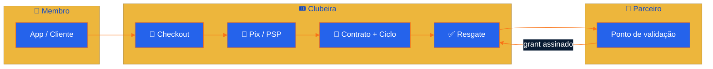
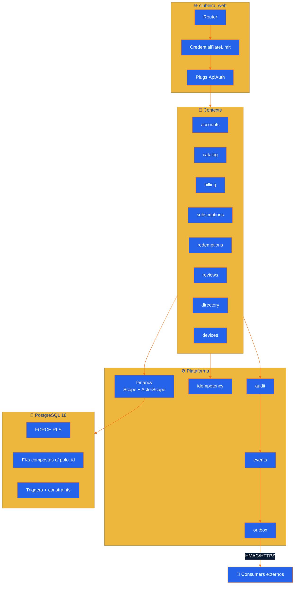
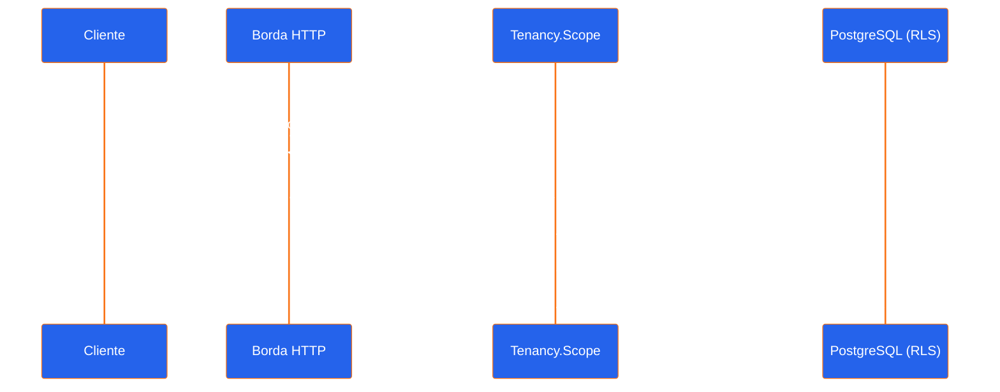
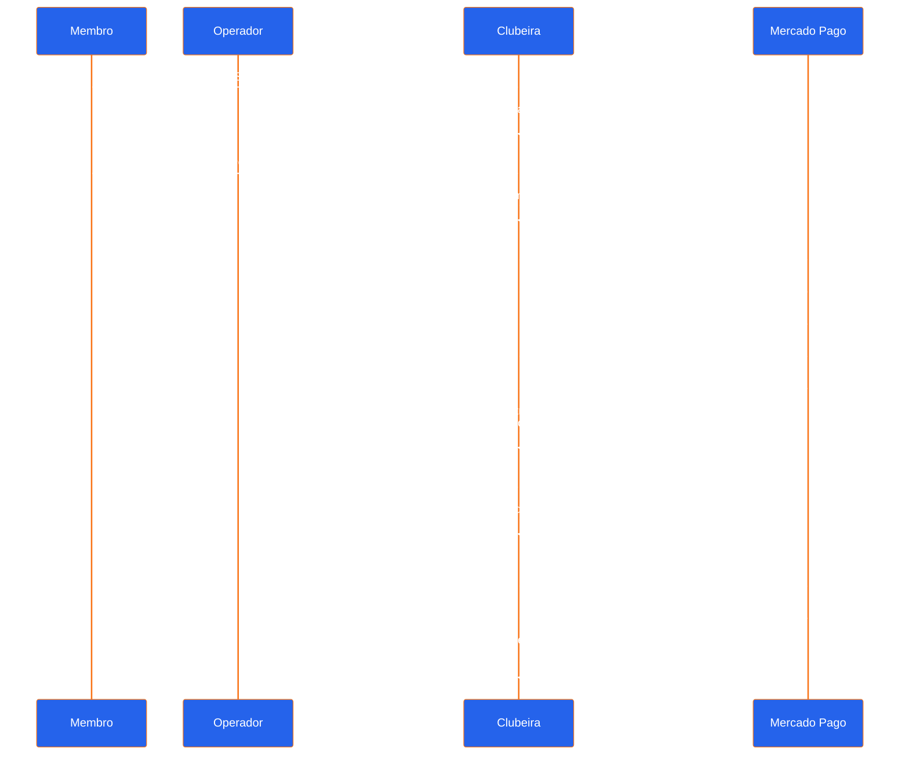
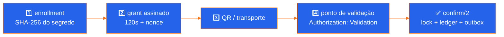

<div align="center">


[](https://elixir-lang.org/)
[](https://www.phoenixframework.org/)
[](https://www.postgresql.org/)
[](https://www.erlang.org/)
[](#-multi-tenancy)
[](./test)
[](./priv/repo/migrations)
[](./LICENSE)

**[🏗️ Arquitetura](docs/architecture.md)** · **[🛠️ Desenvolvimento](docs/development.md)** · **[🤝 Contribuir](CONTRIBUTING.md)** · **[🔐 Segurança](SECURITY.md)**

---

*"Um app, muitos polos. Um usuário, contratos independentes em cada um deles."*

</div>

---

> [!IMPORTANT]
> **RLS é defesa em profundidade, não autorização de negócio.**
> Nenhum `polo_id`, `user_id`, `device_id` ou `validation_point_id` vindo do
> cliente vale como prova de permissão. Toda operação tenant-aware entra num
> `Scope` já autorizado e roda dentro de `Repo.transact_in_polo/3`.

---

## 🎯 Visão geral

Clubeira é o núcleo transacional e o painel administrativo de um SaaS
multi-tenant para clubes de vouchers por assinatura. Um único produto atende
vários polos independentes — cidades, regiões ou franquias — e o mesmo usuário
mantém contratos, ciclos e benefícios separados em cada um.



| Propriedade      | Valor                                                     |
|:-----------------|:----------------------------------------------------------|
| **Arquitetura**  | Monólito modular Elixir/Phoenix/Ecto                       |
| **Fonte de verdade** | PostgreSQL 18, schema único normalizado                |
| **Isolamento**   | `FORCE ROW LEVEL SECURITY` + FKs compostas com `polo_id`   |
| **Identidade**   | UUIDv7 em todas as entidades novas                         |
| **Consistência** | Invariante, auditoria, evento e outbox na mesma transação  |

---

## ✅ O que já funciona

| Domínio | Entregue |
|:--|:--|
| 🔐 **Identidade e LGPD** | cadastro atômico com aceite legal, perfil civil com CPF/telefone cifrados e write-only, consentimentos versionados, solicitações do titular, confirmação de e-mail, sessão bearer revogável e rate limit |
| 🗺️ **Descoberta** | diretório público com perfil, contato, categorias e horários do parceiro, catálogo comercial e opções de checkout — tudo paginado por cursor |
| 🏪 **Parceiros** | onboarding, convênio comercial completo, acesso operacional por estabelecimento, perfil próprio e lifecycle administrativo até revogação/aposentadoria terminal, com idempotência, auditoria, evento e outbox atômicos |
| 🛒 **Venda** | checkout idempotente, Pix e assinatura recorrente via Mercado Pago, histórico do membro, cobrança administrativa, reembolso integral e chargeback; webhooks HMAC sempre releem o recurso no PSP |
| 🏦 **Recebimento** | contas globais vinculadas por vigência a cada polo, com integridade referencial entre tenant e conta |
| 📜 **Assinatura** | planos, contratos, ciclos e alocações por polo, pausa/retomada operacional e renovação aprovada sem reinterpretar versões históricas |
| ✅ **Resgate** | enrollment sem persistir segredo, chave Ed25519 do dispositivo com prova de posse, grant assinado e curto, lifecycle do ponto, consumo atômico com anti-replay, ledger, auditoria, evento e outbox |
| ⭐ **UGC** | avaliações verificadas, mídia validada pelo storage, resposta versionada do parceiro, denúncia, moderação append-only e feed público consistente |
| 🧾 **Plataforma** | catálogo versionado de planos e features, assinatura SaaS do polo, nota, itens e pagamento liquidados por webhook autenticado |
| 🖥️ **Backoffice web** | login com sessão cifrada, navegação por capability, dashboard responsivo e inventário operacional de estabelecimentos com filtros e keyset, sempre pelos contexts reais |
| 🧪 **Base** | migrations reversíveis, seeds determinísticas, factories, RLS forçado, E2E HTTP por TCP e testes de concorrência contra bancos isolados reais |

O fluxo de venda implementado no domínio é:

```text
checkout autenticado
  -> pedido aguardando pagamento
  -> Pix ou acordo recorrente criado pelo adaptador do provedor
  -> captura ou cobrança recorrente autenticada e relida no PSP
  -> pagamento e pedido liquidado
  -> contrato e ciclo de benefício
  -> alocações de vouchers
  -> renovação cria nota, novo ciclo e novas alocações
  -> reembolso integral ou chargeback perdido revoga o saldo restante
```

A liquidação persiste esse resultado de forma atômica e aceita reprocessamento
seguro. Pix usa a Orders API; recorrência usa `preapproval` e
`authorized_payments`; chargeback usa sua consulta oficial. O payload bruto
termina no adaptador e o core recebe somente evidência normalizada depois da
assinatura e do estado remoto serem verificados. O reembolso integral reserva
identidade local antes do I/O e só revoga direitos após confirmação do PSP.
Cartão e reembolso parcial continuam fatias separadas. A API online de resgate já
entrega o grant que um cliente pode renderizar como QR; placard estático,
operação offline e o componente visual de leitura continuam bordas próprias.

---

## ⚡ Subir o projeto

```bash
git clone git@github.com:gabrielmaialva33/clubeira.git && cd clubeira
mise install
mix setup
mix phx.server
```

`mix setup` instala as dependências Elixir, sobe PostgreSQL 18 em
`127.0.0.1:55432`, cria/migra o banco com a role de migration, carrega um
cenário determinístico com os polos **Sobral** e **Londrina** e, por fim,
instala as dependências Node, valida o contrato OpenAPI e compila os assets.

| Endereço | O que é |
|:--|:--|
| <http://localhost:4000> | aplicação |
| <http://localhost:4000/admin> | painel administrativo |
| <http://localhost:4000/admin/places> | inventário de estabelecimentos do polo |
| `/admin/places/:polo_place_id` | detalhe e lifecycle da participação selecionada |
| <http://localhost:4000/health> | liveness do processo |
| <http://localhost:4000/ready> | readiness da role runtime e das migrations |
| <http://localhost:4000/api/docs> | documentação navegável Redocly |
| <http://localhost:4000/openapi/v1.json> | bundle OpenAPI 3.1 para clientes e SDKs |
| <http://localhost:4000/api/v1/polos/sobral/catalog> | catálogo demo |
| <http://localhost:4000/api/v1/polos/sobral/places> | parceiros do polo |
| <http://localhost:4000/api/v1/polos/sobral/checkout-options> | opções de checkout |
| <http://localhost:4000/dev/dashboard> | LiveDashboard (dev) |
| <http://localhost:4000/dev/mailbox> | caixa de e-mail local |

<details>
<summary><strong>📋 Pré-requisitos e credenciais do cenário demo</strong></summary>

| Ferramenta | Versão |
|:--|:--|
| Elixir | `1.20.2-otp-29` |
| Erlang/OTP | `29.0.5` |
| Docker + Compose | PostgreSQL `18.4` |
| Node | `26.2.0` |

As seeds criam `membro.demo@clubeira.local` com a senha local
`clubeira-demo-local`. Defina `CLUBEIRA_DEMO_PASSWORD` antes de `mix setup`
para trocar esse valor. O backoffice separa
`moderador.demo@clubeira.local` / `clubeira-moderador-local` de
`admin.demo@clubeira.local` / `clubeira-admin-local`; só o segundo pode
cadastrar parceiros. O cenário também cria
`parceiro.demo@clubeira.local` / `clubeira-parceiro-local`, vinculado somente
ao Sabores do Acaraú Demo em Sobral. Sobral também recebe um ponto de validação cuja chave
local de demonstração é
`M-bCcLGupP8XuBxzemHd-4JumJf6trsiQpinEl30xwg`; substitua-a por 32 bytes
aleatórios em base64url sem padding via `CLUBEIRA_DEMO_VALIDATION_SECRET` em
qualquer ambiente compartilhado. Para testar o sandbox Pix, defina também
`CLUBEIRA_DEMO_EMAIL` com o e-mail do usuário de teste do Mercado Pago antes de
rodar as seeds. O mesmo membro possui contratos independentes em Sobral e
Londrina. Os três estabelecimentos demo já possuem perfil público completo,
com taxonomia curada, contato, semana de funcionamento e exceções de calendário.

</details>

---

## 🏗️ Arquitetura



<details>
<summary><strong>📋 Fronteiras de domínio</strong></summary>

| Módulo | Responsabilidade |
|:--|:--|
| `accounts` | usuários, credenciais, sessões, escopo do ator |
| `legal` | documentos versionados e aceites imutáveis |
| `polos` | tenants, políticas versionadas, memberships e roles |
| `directory` | cidades, organizações, marcas, endereços e lugares globais |
| `catalog` | acordos, ofertas, versões, janelas, blackouts e preços |
| `billing` | pedidos, intents, pagamentos e a borda do PSP |
| `subscriptions` | contratos, ciclos e carteira de alocações |
| `devices` | instalações autorizadas e grants assinados |
| `redemptions` | tentativas, resgates, ledger e anti-replay |
| `reviews` | avaliações verificadas, revisões e moderação |
| `tenancy` | `Scope`, `ActorScope` e as fronteiras transacionais |
| `idempotency` / `audit` / `events` / `outbox` | infraestrutura de confiabilidade |

</details>

---

## 🔐 Multi-tenancy

Um único schema PostgreSQL, compartilhado pelos polos e normalizado. Dados
tenant carregam `polo_id`; chaves estrangeiras compostas impedem referências
entre polos e todas as tabelas com `polo_id` são protegidas por RLS forçado.



| Camada | Mecanismo |
|:--|:--|
| **Integridade relacional** | FKs compostas com `polo_id`: uma linha de Sobral não referencia entidade de Londrina |
| **Escopo na aplicação** | `Tenancy.Scope` + `Repo.transact_in_polo/3` gravam polo/ator/request só durante a transação |
| **Defesa no banco** | `FORCE ROW LEVEL SECURITY` em toda relação tenant e em `outbox_messages` |
| **Role de runtime** | `clubeira_app` é `NOSUPERUSER NOBYPASSRLS`, sem DDL e sem ownership |

<details>
<summary><strong>📋 Roles, descoberta global e o resto dos detalhes</strong></summary>

Existem credenciais locais diferentes para cada responsabilidade:

- `clubeira_migrator`: dona do schema, usada apenas por migrations e seeds;
- `clubeira_app`: role de runtime `NOSUPERUSER NOBYPASSRLS`, sem permissão de
  DDL;
- `postgres`: administração local e testes; cada teste assume uma role
  temporária restrita antes de acessar os dados.

Autenticação é global: `POST /api/v1/auth/registrations` valida e normaliza o
email, exige todas as versões de termos vigentes publicadas por
`GET /api/v1/legal/registration`, e cria usuário ativo, aceite imutável, hash
Argon2id, sessão e auditoria na mesma transação.
`user_password_credentials` separa o segredo da identidade e `user_sessions`
persiste somente SHA-256 do bearer opaco. Recuperação de senha também usa 32
bytes aleatórios e grava apenas o digest em `user_password_reset_tokens`; o
token expira, é de uso único e uma nova solicitação revoga a anterior. O
consumo troca a credencial, revoga todas as sessões, consome o token e audita a
operação na mesma transação. A confirmação de e-mail repete o mesmo padrão de
32 bytes + digest em `user_email_verification_tokens`; resend autenticado revoga
a credencial anterior, e confirmações concorrentes ou repetidas geram um único
fato auditável. Cadastro, login, verificação e as duas bordas de recuperação têm
limites locais por instância para tráfego global, IP e identidade, além de um
teto fail-fast para operações Argon2 concorrentes. Um limitador no ingress
continua obrigatório para impor o teto do cluster. Credenciais temporárias e
sessões terminais são removidas após a retenção configurada, 30 dias por padrão.

Cada requisição recebe um UUIDv7 interno em `x-request-id`, também usado para
correlacionar eventos globais de autenticação. Valores enviados pelo cliente
nesse header não viram identificadores da trilha forense. Para a tela
cross-polo, `user_contract_polo_routes` revela ao ator apenas os IDs dos polos
onde ele já contratou. Isso é um índice de roteamento, não uma autorização:
contrato, ciclo e saldo são relidos dentro da RLS de cada polo.

`GET /api/v1/me/access` é o bootstrap de navegação autenticada: devolve roles e
capabilities globais da plataforma e, por polo, somente memberships vigentes,
roles ativas e capacidades derivadas no servidor. A resposta não contém IDs de
membership/assignment e nunca autoriza uma operação seguinte; cada endpoint
continua relendo a capacidade dentro da fronteira transacional correta.

O endereço público de cada tenant fica na relação global 1:1 `polo_routes`.
Ela resolve apenas `slug -> polo_id`; depois disso, até a leitura pública do
catálogo entra numa transação com RLS e confirma que o polo está ativo. A
policy pública permite somente leitura das rotas; mutações continuam presas ao
`polo_id` ativo.

`GET /api/v1/polos` completa essa entrada do cliente com uma projeção paginada
dos polos ativos e sua identidade pública de cidade. Uma policy dedicada libera
somente `SELECT` dos polos ativos; polos não ativos permanecem invisíveis e as
mutações continuam exigindo o escopo tenant.

O catálogo aceita paginação por cursor com `?limit=20&after=...` (`20` por
padrão, máximo `100`) e devolve o próximo cursor em `meta.page.next_cursor`.
Ele publica o catálogo comercial vigente do polo; disponibilidade individual,
janelas e blackouts são regras da elegibilidade de resgate, não dessa vitrine
pública.

As contas de recebimento ficam em `merchant_accounts` e podem ser
compartilhadas entre polos. A relação normalizada `polo_merchant_accounts`
define quais contas cada polo pode usar, sua função e seu período de vigência.
Pagamentos, intents e eventos do provedor usam chaves compostas para impedir
que uma conta seja referenciada pelo tenant errado. O runtime lê apenas
vínculos vigentes do polo atual; mutações são reservadas à role dona do schema.

```sh
mix db.migrate  # sobe o container e migra com clubeira_migrator
mix db.reset    # recria o schema de desenvolvimento e reaplica as seeds
docker compose stop
```

`docker compose down` remove somente o container e a rede. O comando
`docker compose down -v` também apaga o volume e todos os dados locais.

</details>

---

## 🛰️ API

| Método | Rota | Auth |
|:--|:--|:--:|
| `GET` | `/api/v1/legal/registration` | 🌐 |
| `POST` | `/api/v1/auth/registrations` | 🌐 |
| `POST` | `/api/v1/auth/sessions` | 🌐 |
| `POST` | `/api/v1/auth/email-verifications` | 🌐 |
| `POST` | `/api/v1/auth/email-verification-requests` | 🔑 |
| `POST` | `/api/v1/auth/password-reset-requests` | 🌐 |
| `POST` | `/api/v1/auth/password-resets` | 🌐 |
| `DELETE` | `/api/v1/auth/session` | 🔑 |
| `GET` | `/api/v1/me` | 🔑 |
| `GET` | `/api/v1/me/profile` | 🔑 |
| `PUT` | `/api/v1/me/profile` | 🔑 |
| `GET` | `/api/v1/me/privacy/consents` | 🔑 |
| `PUT` | `/api/v1/me/privacy/consents/:purpose_code` | 🔑 |
| `GET` | `/api/v1/me/privacy/requests` | 🔑 |
| `POST` | `/api/v1/me/privacy/requests` | 🔑 |
| `GET` | `/api/v1/polos` | 🌐 |
| `GET` | `/api/v1/polos/:slug/catalog` | 🌐 |
| `GET` | `/api/v1/polos/:slug/checkout-options` | 🌐 |
| `GET` | `/api/v1/polos/:slug/places` | 🌐 |
| `GET` | `/api/v1/polos/:slug/places/:place_id/reviews` | 🌐 |
| `GET` | `/api/v1/polos/:slug/review-media/:media_id` | 🌐 |
| `POST` | `/api/v1/polos/:slug/redemptions` | 🏪 |
| `POST` | `/api/v1/webhooks/mercado-pago/:merchant_account_id` | 🔏 |
| `POST` | `/api/v1/webhooks/:provider_code/:merchant_account_id` | 🔏 |
| `GET` | `/api/v1/me/access` | 🔑 |
| `GET` | `/api/v1/me/subscriptions` | 🔑 |
| `GET` | `/api/v1/polos/:slug/me/billing` | 🔑 |
| `POST` | `/api/v1/polos/:slug/orders` | 🔑 |
| `POST` | `/api/v1/polos/:slug/orders/:order_id/payment-intents` | 🔑 |
| `POST` | `/api/v1/polos/:slug/orders/:order_id/billing-agreements` | 🔑 |
| `GET` | `/api/v1/polos/:slug/me/orders` | 🔑 |
| `GET` | `/api/v1/polos/:slug/me/vouchers` | 🔑 |
| `POST` | `/api/v1/polos/:slug/me/redemption-devices` | 🔑 |
| `GET` | `/api/v1/me/devices/:device_id/key` | 🔑 |
| `PUT` | `/api/v1/me/devices/:device_id/key` | 🔑 |
| `POST` | `/api/v1/polos/:slug/me/redemption-grants` | 🔑 |
| `GET` | `/api/v1/polos/:slug/me/redemptions` | 🔑 |
| `POST` | `/api/v1/polos/:slug/places/:place_id/reviews` | 🔑 |
| `POST` | `/api/v1/polos/:slug/places/:place_id/reviews/:review_id/media` | 🔑 |
| `POST` | `/api/v1/polos/:slug/places/:place_id/reviews/:review_id/reports` | 🔑 |
| `POST` | `/api/v1/polos/:slug/backoffice/partners` | 🛡️ |
| `POST` | `/api/v1/polos/:slug/backoffice/places/:place_id/partner-accesses` | 🛡️ |
| `POST` | `/api/v1/polos/:slug/backoffice/partner-accesses/:access_id/revocations` | 🛡️ |
| `GET` | `/api/v1/polos/:slug/backoffice/places` | 🛡️ |
| `POST` | `/api/v1/polos/:slug/backoffice/places/:place_id/lifecycle-actions` | 🛡️ |
| `PUT` | `/api/v1/polos/:slug/backoffice/places/:place_id/profile` | 🛡️ |
| `POST` | `/api/v1/polos/:slug/backoffice/places/:place_id/benefit-offers` | 🛡️ |
| `GET` | `/api/v1/polos/:slug/backoffice/benefit-offers` | 🛡️ |
| `GET` | `/api/v1/polos/:slug/backoffice/product-offerings` | 🛡️ |
| `POST` | `/api/v1/polos/:slug/backoffice/product-offerings` | 🛡️ |
| `POST` | `/api/v1/polos/:slug/backoffice/product-offerings/:product_offering_id/lifecycle-actions` | 🛡️ |
| `GET` | `/api/v1/polos/:slug/backoffice/partner-agreements` | 🛡️ |
| `POST` | `/api/v1/polos/:slug/backoffice/partner-agreements` | 🛡️ |
| `GET` | `/api/v1/polos/:slug/backoffice/partner-agreements/:agreement_id` | 🛡️ |
| `GET` | `/api/v1/polos/:slug/backoffice/payments` | 🛡️ |
| `GET` | `/api/v1/polos/:slug/backoffice/subscriptions` | 🛡️ |
| `POST` | `/api/v1/polos/:slug/backoffice/subscriptions/:contract_id/lifecycle-actions` | 🛡️ |
| `POST` | `/api/v1/polos/:slug/backoffice/payments/:payment_id/refunds` | 🛡️ |
| `GET` | `/api/v1/polos/:slug/backoffice/audit-events` | 🛡️ |
| `GET` | `/api/v1/polos/:slug/backoffice/outbox-messages` | 🛡️ |
| `POST` | `/api/v1/polos/:slug/backoffice/outbox-messages/:message_id/retries` | 🛡️ |
| `POST` | `/api/v1/polos/:slug/backoffice/platform-subscription` | 🛡️ |
| `GET` | `/api/v1/polos/:slug/backoffice/platform-billing` | 🛡️ |
| `GET` | `/api/v1/polos/:slug/backoffice/validation-points` | 🛡️ |
| `POST` | `/api/v1/polos/:slug/backoffice/places/:place_id/validation-points` | 🛡️ |
| `POST` | `/api/v1/polos/:slug/backoffice/validation-points/:validation_point_id/lifecycle-actions` | 🛡️ |
| `POST` | `/api/v1/polos/:slug/backoffice/validation-credentials/:credential_id/rotations` | 🛡️ |
| `POST` | `/api/v1/polos/:slug/backoffice/validation-credentials/:credential_id/revocations` | 🛡️ |
| `GET` | `/api/v1/polos/:slug/backoffice/reviews` | 🛡️ |
| `POST` | `/api/v1/polos/:slug/backoffice/reviews/:review_id/moderation-actions` | 🛡️ |
| `GET` | `/api/v1/polos/:slug/backoffice/review-reports` | 🛡️ |
| `POST` | `/api/v1/polos/:slug/backoffice/review-reports/:review_report_id/moderation-actions` | 🛡️ |
| `GET` | `/api/v1/polos/:slug/partner/places` | 🤝 |
| `PUT` | `/api/v1/polos/:slug/partner/reviews/:review_id/response` | 🤝 |
| `PUT` | `/api/v1/polos/:slug/partner/places/:place_id/profile` | 🤝 |
| `GET` | `/api/v1/platform/privacy/processing-purposes` | 🧭 |
| `PUT` | `/api/v1/platform/privacy/processing-purposes/:purpose_code` | 🧭 |
| `GET` | `/api/v1/platform/privacy/requests` | 🧭 |
| `POST` | `/api/v1/platform/privacy/requests/:request_id/transitions` | 🧭 |
| `GET` | `/api/v1/platform/billing/plans` | 🧭 |
| `PUT` | `/api/v1/platform/billing/plans/:plan_code/versions/:version` | 🧭 |

🌐 público · 🔑 bearer do membro · 🏪 credencial do ponto de validação · 🔏 HMAC do PSP · 🛡️ membership administrativo · 🤝 parceiro atribuído ao estabelecimento · 🧭 role global da plataforma; cada rota relê sua capacidade no banco

Mensagens humanas de erro negociam `Accept-Language` com pesos `q`: `pt-BR` e
`en` são suportados, idiomas desconhecidos caem deterministicamente em inglês
e a resposta declara `Content-Language`. Códigos de erro, IDs, enums e estados
continuam estáveis e nunca são traduzidos.

<details>
<summary><strong>📋 Exemplos com <code>curl</code></strong></summary>

```sh
curl -sS 'http://localhost:4000/api/v1/legal/registration?locale=pt-BR'

curl -sS -X POST http://localhost:4000/api/v1/auth/registrations \
  -H 'content-type: application/json' \
  -d '{"email":"novo@example.test","password":"uma-senha-com-15-chars","legal_document_version_ids":["<legal_version_uuid>"]}'

curl -i -sS -X POST http://localhost:4000/api/v1/auth/email-verifications \
  -H 'content-type: application/json' \
  -d '{"token":"<email_verification_token>"}'

curl -i -sS -X POST http://localhost:4000/api/v1/auth/email-verification-requests \
  -H "authorization: Bearer $TOKEN"

curl -sS http://localhost:4000/api/v1/auth/sessions \
  -H 'content-type: application/json' \
  -d '{"email":"membro.demo@clubeira.local","password":"clubeira-demo-local"}'

curl -sS http://localhost:4000/api/v1/me \
  -H "authorization: Bearer $TOKEN"

curl -sS 'http://localhost:4000/api/v1/polos?limit=20'

curl -sS http://localhost:4000/api/v1/me/access \
  -H "authorization: Bearer $TOKEN"

curl -i -sS -X POST http://localhost:4000/api/v1/auth/password-reset-requests \
  -H 'content-type: application/json' \
  -d '{"email":"membro.demo@clubeira.local"}'

# Copie o token entregue em http://localhost:4000/dev/mailbox
curl -i -sS -X POST http://localhost:4000/api/v1/auth/password-resets \
  -H 'content-type: application/json' \
  -d '{"token":"<reset_token>","password":"uma-nova-senha-com-15-chars"}'

curl -sS http://localhost:4000/api/v1/me/subscriptions \
  -H "authorization: Bearer $TOKEN"

curl -sS -X POST http://localhost:4000/api/v1/polos/sobral/backoffice/partners \
  -H "authorization: Bearer $ADMIN_TOKEN" \
  -H 'idempotency-key: parceiro-sobral-001' \
  -H 'content-type: application/json' \
  -d '{"organization":{"legal_name":"Bistrô da Serra Ltda.","trade_name":"Bistrô da Serra","cnpj":"12.ABC.345/01DE-35"},"place":{"name":"Bistrô da Serra Centro","slug":"bistro-da-serra-centro","address":{"postal_code":"62010-000","street":"Rua das Flores","number":"42","district":"Centro"}}}'

curl -sS -X POST \
  http://localhost:4000/api/v1/polos/sobral/backoffice/places/<place_uuid>/partner-accesses \
  -H "authorization: Bearer $ADMIN_TOKEN" \
  -H 'idempotency-key: acesso-parceiro-sobral-001' \
  -H 'content-type: application/json' \
  -d '{"email":"parceiro.demo@clubeira.local"}'

curl -sS http://localhost:4000/api/v1/polos/sobral/partner/places \
  -H "authorization: Bearer $PARTNER_TOKEN"

curl -sS -X PUT \
  http://localhost:4000/api/v1/polos/sobral/backoffice/places/<place_uuid>/profile \
  -H "authorization: Bearer $ADMIN_TOKEN" \
  -H 'idempotency-key: perfil-bistro-sobral-001' \
  -H 'content-type: application/json' \
  -d '{"contact":{"email":"reservas@bistro.example","phone":"(88) 99999-0101"},"category_keys":["restaurant","regional-cuisine"],"weekly_hours":[{"weekday":1,"opens_at":"11:30","closes_at":"15:00"},{"weekday":1,"opens_at":"18:00","closes_at":"23:00"}],"special_hours":[{"date":"2026-12-25","kind":"closed"}],"expected_polo_place_id":"<polo_place_uuid>","expected_revision":0}'

curl -sS -X POST \
  http://localhost:4000/api/v1/polos/sobral/backoffice/places/<place_uuid>/benefit-offers \
  -H "authorization: Bearer $ADMIN_TOKEN" \
  -H 'idempotency-key: cafe-cortesia-sobral-001' \
  -H 'content-type: application/json' \
  -d '{"offer":{"code":"cafe-cortesia","name":"Café cortesia","benefit_kind":"discount_percentage"},"version":{"title":"15% no café da manhã","description":"Desconto no consumo do café da manhã.","terms":"Um uso por ciclo, de segunda a sexta.","redemption_instructions":"Apresente o voucher antes de pedir a conta.","percentage_value":"15.0000","effective_during":{"starts_at":"2026-08-01T00:00:00Z","ends_at":null}}}'

curl -sS -X POST \
  http://localhost:4000/api/v1/polos/sobral/backoffice/product-offerings \
  -H "authorization: Bearer $ADMIN_TOKEN" \
  -H 'idempotency-key: clube-sobral-premium-001' \
  -H 'content-type: application/json' \
  -d '{"offering":{"code":"clube-sobral-premium","name":"Clube Sobral Premium","description":"Plano mensal com benefícios publicados pelo polo.","cycle":{"policy":"calendar","interval_unit":"month","interval_count":1},"effective_during":{"starts_at":"2026-08-01T00:00:00Z","ends_at":null}},"price":{"currency":"BRL","amount":"39.90"},"benefits":[{"benefit_offer_version_id":"<benefit_version_uuid>","allowance_per_cycle":2,"consumption_unit":"per_place"}]}'

curl -sS \
  'http://localhost:4000/api/v1/polos/sobral/backoffice/product-offerings?status=paused&limit=20' \
  -H "authorization: Bearer $ADMIN_TOKEN"

curl -sS -X POST \
  http://localhost:4000/api/v1/polos/sobral/backoffice/product-offerings/<product_offering_uuid>/lifecycle-actions \
  -H "authorization: Bearer $ADMIN_TOKEN" \
  -H 'idempotency-key: pausa-clube-sobral-premium-001' \
  -H 'content-type: application/json' \
  -d '{"action":"pause","reason":"Revisão preventiva da configuração comercial"}'

curl -sS \
  'http://localhost:4000/api/v1/polos/sobral/backoffice/payments?status=captured&limit=20' \
  -H "authorization: Bearer $ADMIN_TOKEN"

curl -sS \
  'http://localhost:4000/api/v1/polos/sobral/backoffice/subscriptions?status=active&limit=20' \
  -H "authorization: Bearer $ADMIN_TOKEN"

curl -sS -X POST \
  http://localhost:4000/api/v1/polos/sobral/backoffice/payments/<payment_uuid>/refunds \
  -H "authorization: Bearer $ADMIN_TOKEN" \
  -H 'idempotency-key: reembolso-atendimento-001' \
  -H 'content-type: application/json' \
  -d '{"reason":"Cancelamento confirmado pelo atendimento"}'

curl -sS \
  'http://localhost:4000/api/v1/polos/sobral/backoffice/validation-points?status=active&limit=20' \
  -H "authorization: Bearer $ADMIN_TOKEN"

VALIDATION_SECRET="$(openssl rand -base64 32 | tr '+/' '-_' | tr -d '=\n')"
VALIDATION_SECRET_SHA256="$(printf '%s=' "$VALIDATION_SECRET" | tr '_-' '/+' | openssl base64 -d -A | openssl dgst -sha256 -binary | openssl base64 -A | tr '+/' '-_' | tr -d '=\n')"
VALIDATION_EXPIRES_AT="$(date -u -d '+90 days' +%Y-%m-%dT%H:%M:%SZ)"

curl -sS -X POST \
  http://localhost:4000/api/v1/polos/sobral/backoffice/places/<place_uuid>/validation-points \
  -H "authorization: Bearer $ADMIN_TOKEN" \
  -H 'idempotency-key: caixa-bistro-sobral-001' \
  -H 'content-type: application/json' \
  -d "{\"name\":\"Caixa principal\",\"credential\":{\"secret_sha256\":\"$VALIDATION_SECRET_SHA256\",\"expires_at\":\"$VALIDATION_EXPIRES_AT\"}}"

NEXT_VALIDATION_SECRET="$(openssl rand -base64 32 | tr '+/' '-_' | tr -d '=\n')"
NEXT_VALIDATION_SECRET_SHA256="$(printf '%s=' "$NEXT_VALIDATION_SECRET" | tr '_-' '/+' | openssl base64 -d -A | openssl dgst -sha256 -binary | openssl base64 -A | tr '+/' '-_' | tr -d '=\n')"

curl -sS -X POST \
  http://localhost:4000/api/v1/polos/sobral/backoffice/validation-credentials/<current_credential_uuid>/rotations \
  -H "authorization: Bearer $ADMIN_TOKEN" \
  -H 'idempotency-key: rotacao-caixa-bistro-sobral-001' \
  -H 'content-type: application/json' \
  -d "{\"credential\":{\"secret_sha256\":\"$NEXT_VALIDATION_SECRET_SHA256\",\"expires_at\":\"$VALIDATION_EXPIRES_AT\"}}"

curl -sS -X POST \
  http://localhost:4000/api/v1/polos/sobral/backoffice/validation-points/<validation_point_uuid>/lifecycle-actions \
  -H "authorization: Bearer $ADMIN_TOKEN" \
  -H 'idempotency-key: suspensao-caixa-bistro-sobral-001' \
  -H 'content-type: application/json' \
  -d '{"action":"suspend","reason":"Manutenção emergencial do terminal"}'

curl -sS -X POST \
  http://localhost:4000/api/v1/polos/sobral/backoffice/validation-credentials/<current_credential_uuid>/revocations \
  -H "authorization: Bearer $ADMIN_TOKEN" \
  -H 'idempotency-key: revogacao-caixa-bistro-sobral-001'

curl -sS http://localhost:4000/api/v1/polos/sobral/me/vouchers \
  -H "authorization: Bearer $TOKEN"

INSTALLATION_TOKEN="$(openssl rand -base64 32 | tr '+/' '-_' | tr -d '=')"

curl -sS -X POST http://localhost:4000/api/v1/polos/sobral/me/redemption-devices \
  -H "authorization: Bearer $TOKEN" \
  -H 'content-type: application/json' \
  -d "{\"access_contract_id\":\"<contract_uuid>\",\"installation_token\":\"$INSTALLATION_TOKEN\",\"platform\":\"web\"}"

curl -sS -X POST http://localhost:4000/api/v1/polos/sobral/me/redemption-grants \
  -H "authorization: Bearer $TOKEN" \
  -H 'content-type: application/json' \
  -d "{\"entitlement_allocation_id\":\"<allocation_uuid>\",\"installation_token\":\"$INSTALLATION_TOKEN\"}"

curl -sS -X POST http://localhost:4000/api/v1/polos/sobral/redemptions \
  -H "authorization: Validation $VALIDATION_SECRET" \
  -H 'idempotency-key: merchant-redemption-001' \
  -H 'content-type: application/json' \
  -d '{"grant":"<signed_grant>"}'

curl -sS http://localhost:4000/api/v1/polos/sobral/checkout-options

curl -sS http://localhost:4000/api/v1/polos/sobral/places

curl -sS -X POST http://localhost:4000/api/v1/polos/sobral/orders \
  -H "authorization: Bearer $TOKEN" \
  -H 'content-type: application/json' \
  -H 'idempotency-key: checkout-mobile-001' \
  -d '{"product_offering_version_id":"<uuid>","offering_price_id":"<uuid>"}'

curl -sS -X POST \
  http://localhost:4000/api/v1/polos/sobral/orders/<order_uuid>/payment-intents \
  -H "authorization: Bearer $TOKEN" \
  -H 'content-type: application/json' \
  -H 'idempotency-key: payment-mobile-001' \
  -d '{"payment_method":"pix"}'

curl -sS http://localhost:4000/api/v1/polos/sobral/me/orders \
  -H "authorization: Bearer $TOKEN"

curl -sS http://localhost:4000/api/v1/polos/sobral/me/redemptions \
  -H "authorization: Bearer $TOKEN"

curl -sS -X POST http://localhost:4000/api/v1/polos/sobral/places/<place_uuid>/reviews \
  -H "authorization: Bearer $TOKEN" \
  -H 'content-type: application/json' \
  -H 'idempotency-key: review-mobile-001' \
  -d '{"source_redemption_id":"<redemption_uuid>","rating":5,"title":"Muito bom","body":"Benefício entregue como anunciado."}'
```

O comando de login devolve `data.access_token`; atribua-o a `TOKEN` apenas na
sessão do shell. `DELETE /api/v1/auth/session` revoga a sessão atual. A listagem
de assinaturas também usa cursor: `?limit=20&after=...`, com limite máximo de
`100` polos e metadados em `meta.page`. O checkout exige uma única chave
`Idempotency-Key`, aceita somente uma unidade e deriva comprador, polo, moeda e
preço novamente no servidor. `GET /api/v1/polos/:slug/checkout-options`
publica as combinações de `product_offering_version_id` e `offering_price_id`
atualmente provisionáveis, também com cursor e limite máximo de `100`. Repetir
a mesma seleção com a mesma chave devolve o pedido original; reutilizar a chave
para outra seleção retorna conflito.

A publicação comercial do backoffice exige `admin` e `Idempotency-Key`. Ela
recebe somente versões de benefício já publicadas e monta no servidor o produto,
a oferta direta, o preço recorrente, o pacote, o escopo e seus itens em versões
iniciais imutáveis. Todos os benefícios e lugares precisam cobrir o período
completo da oferta; o grafo só aparece em `checkout-options` quando também é
provisionável pelo fluxo real de liquidação.

O lifecycle comercial aceita `pause`, `reactivate` e `retire`. A pausa corta
imediatamente descoberta e novos checkouts, mas não invalida um pedido já
criado; a liquidação continua usando sua versão histórica. Reativação devolve a
identidade a `active`, sujeita à releitura normal de todo o grafo, e aposentadoria
é terminal. Cada sucesso incrementa a revisão e grava audit, evento e outbox na
mesma transação; o motivo operacional permanece somente na auditoria.

O histórico de pedidos retorna somente os pedidos do ator naquele polo, do
mais novo para o mais antigo, com os itens e valores históricos; ele usa
`?limit=20&after=...` e limita cada página a `100` pedidos. O diretório público
usa a mesma paginação para listar somente participações, lugares, marcas e
operadores ativos, incluindo endereço, coordenadas e o perfil publicado quando
cadastrados. O perfil é uma substituição completa: dias seguem ISO `1` (segunda)
a `7` (domingo), telefone é normalizado para E.164 e exceções usam `closed` ou
`custom`; a primeira publicação usa revisão esperada `0` e as seguintes usam a
revisão retornada pela API. Após um
resgate confirmado, o membro pode enviar uma avaliação de `1` a `5` estrelas
com texto não vazio. A API prova no banco que o resgate pertence ao ator, polo
e lugar da rota, cria a avaliação como `pending` e exige `Idempotency-Key`;
título é opcional e mídia fica para uma fatia posterior. O histórico
autenticado de resgates retorna o `id` usado como `source_redemption_id`, a
identidade do lugar e a versão histórica do benefício; quando o lugar já foi
avaliado, inclui também o aggregate de review.

</details>

---

## 🔁 Fluxos críticos

### 💸 Pix e a borda do PSP



O início do pagamento aceita hoje somente `pix`. A resposta contém uma ação
normalizada com `redirect_url` e `copy_paste_code`; repetir a mesma chave
devolve o mesmo intent sem criar outra order no PSP. Timeout ambíguo reutiliza
o UUID interno do intent como `X-Idempotency-Key` no Mercado Pago. O webhook
assinado relê `GET /v1/orders/:id`, provisiona contrato, ciclo e vouchers apenas
para uma captura `processed/accredited`, fecha intents expirados e reconcilia
notificações repetidas sem duplicar pagamento ou direito.

O reembolso disponível é integral e administrativo. A API deriva valor, moeda,
conta e referências do pagamento capturado; o cliente envia somente motivo e
`Idempotency-Key`. A reserva local acontece antes do POST ao PSP. Timeout é
retomado com o UUID do mesmo refund e o webhook também relê a order para fechar
uma resposta perdida. A conclusão preserva consumo histórico, cancela contrato
e ciclos ativos e lança `refund_revocation` apenas para o saldo ainda disponível.
Reembolso parcial fica rejeitado por desenho até existir uma política explícita
para direitos já consumidos.

### ✅ Resgate online



O enrollment aceita apenas um segredo de instalação gerado com 32 bytes
aleatórios e persiste seu SHA-256. Usuário, polo e contrato são relidos da
sessão e do banco; o limite de dispositivos vem da versão de policy congelada
no contrato. O grant dura 120 segundos por padrão, vincula polo, ator,
alocação, instalação e nonce, e não aceita IDs de ponto de validação do
cliente. A confirmação deriva esse ponto de uma credencial ativa, executa a
autenticação e `Clubeira.Redemptions.confirm/2` na mesma transação e mantém o
replay idempotente.

O backoffice registra um ponto `api` somente para uma participação ativa. O
cliente gera e conserva a chave de 32 bytes e envia ao provisionamento apenas
seu SHA-256 em base64url; a resposta, auditoria, evento, outbox e idempotência
nunca carregam chave ou digest. A primeira credencial recebe vigência explícita
de até 365 dias. Retry exato reproduz o DTO original mesmo se o ponto mudar de
estado depois; digest já registrado retorna conflito estável sem deixar ponto
órfão.

A rotação mira na URL a credencial que o operador acredita ser a atual. O
comando fecha sua vigência no relógio transacional, preserva hash e versão
históricos e cria a próxima versão com o mesmo instante inicial. A chave antiga
deixa de autenticar imediatamente; se já estava vencida, recebe estado
`expired` antes da renovação. Retry exato reproduz a resposta original, enquanto
um alvo já substituído retorna `validation_credential_stale` e não derruba a
chave vencedora. Digest duplicado também restaura a credencial corrente antes do
conflito auditado. Chave e digest novos continuam fora da resposta, auditoria,
evento, outbox e idempotência.

A rotação também permanece disponível com o ponto suspenso, permitindo instalar
uma chave nova antes da reativação. O ponto continua sem autenticar até receber
`reactivate`; uma credencial explicitamente revogada continua terminal.

A revogação administrativa usa o mesmo ID corrente como precondição, encerra a
vigência sem criar substituta e bloqueia a autenticação imediatamente. Ela
continua disponível quando o ponto já está suspenso, para funcionar como
kill-switch operacional. Retry exato devolve o mesmo DTO; alvo substituído ou
já revogado produz um único `409` idempotente e auditado. Rotação e revogação
compartilham a trava por ponto: sob concorrência há um único vencedor, e uma
revogação explícita é terminal — a rotação não pode reativá-la.

O lifecycle administrativo do ponto API aceita `suspend`, `reactivate` e `retire`
com motivo obrigatório e `Idempotency-Key`. Suspensão corta a autenticação sem
alterar a credencial e pode ser revertida somente enquanto participação, lugar
e credencial corrente continuam ativos. `retire` é terminal e revoga a
credencial corrente na mesma transação. Todas essas operações compartilham a
trava por ponto com rotação e revogação; uma revisão monotônica ordena o stream
do agregado sem colisões. O motivo operacional fica apenas na auditoria tenant,
nunca no evento ou na outbox.

---

## 🚀 Release de produção

O `Dockerfile` multi-stage fixa Elixir `1.20.2`, OTP `29.0.5` e as imagens por
digest. A imagem final não contém Mix nem toolchain, executa como `nobody`, usa
`tini` como PID 1 e inclui somente a release montada.

```bash
# Artefato OTP local
MIX_ENV=prod mix assets.deploy
MIX_ENV=prod mix release --overwrite

docker build --tag clubeira:release .

# Job único, somente com MIGRATOR_DATABASE_URL e sem segredos web:
docker run --rm --env-file /run/secrets/clubeira-migrator.env \
  clubeira:release /app/bin/migrate

# Bootstrap estrutural explícito; o manifesto e os termos são mounts read-only:
docker run --rm --env-file /run/secrets/clubeira-migrator.env \
  --env CLUBEIRA_BOOTSTRAP_FILE=/run/config/clubeira-bootstrap.json \
  --mount type=bind,src=/run/config,dst=/run/config,readonly \
  clubeira:release /app/bin/bootstrap

# Processo HTTP, somente com DATABASE_URL da role restrita:
docker run --env-file /run/secrets/clubeira-runtime.env \
  --publish 4000:4000 clubeira:release
```

Os dois arquivos acima são secret files separados montados pelo orquestrador;
as variáveis e limites aceitos estão documentados em `.env.example`.

Antes da primeira migration, o administrador do banco executa
`docker/postgres/provision-production.sql`; depois da migration, executa o
mesmo script novamente para reconciliar objetos já existentes e valida a
conexão autenticada como `clubeira_app` com
`docker/postgres/verify-runtime-role.sql`. O script não cria database, não
define senha e é idempotente; autenticação por password, certificado ou IAM
fica no provedor de segredos.

`config/bootstrap.example.json` é o contrato do primeiro polo. O comando cria,
em uma transação serializada, cidade, polo, rota, termos legais imutáveis, role
`admin`, provedor, merchant account e vínculo composto polo/conta. O manifesto
não contém senha nem token PSP; o conteúdo legal é lido do mount, conferido por
SHA-256 e somente o digest é persistido. UUIDs da operação e do polo são UUIDv7
estáveis. Repetir o comando devolve o mesmo resultado; qualquer divergência de
campo aborta tudo e fica registrada uma única auditoria da aplicação bem-sucedida.

Se `admin_email` estiver configurado, a primeira execução normalmente retorna
`pending_registration`. Cadastre e verifique esse usuário pelos endpoints
públicos normais, então execute o mesmo manifesto outra vez: o retorno passa a
`granted` e a membership/role tenant é criada e auditada sob RLS. O bootstrap
nunca cria usuário, senha, sessão nem aceite legal artificial.

TLS até o PostgreSQL é obrigatório por default e verifica certificado e
hostname. `DATABASE_CA_CERT_FILE` aceita uma CA privada por caminho absoluto;
`DATABASE_SSL=false` existe somente para redes locais explicitamente isoladas.
`PHX_HOST`, `PORT`, `POOL_SIZE` e demais entradas são validadas antes do boot.
O modo migrator recusa `PHX_SERVER=true` e não exige `SECRET_KEY_BASE`, chaves
de identificador ou credenciais do mailer.

`GET /health` prova apenas que o processo HTTP vive. `GET /ready` também prova
que a conexão usa uma role segura, possui os grants esperados, só lê
`schema_migrations` e não possui migrations pendentes; falhas devolvem `503`
sem vazar detalhe do PostgreSQL.

---

## 🧪 Qualidade

```bash
mix test        # suíte completa
mix test --failed
npm run api:check # lint Redocly e prova que o bundle publicado está atualizado
mix quality     # OpenAPI, format, compile, Credo, audits, Sobelow e cobertura >= 90%
mix dialyzer
mix precommit   # formata e executa o quality gate
```

A CI repete as migrations a partir de um banco vazio, testa o rollback total,
valida roles/grants/RLS, monta e sobe a release real e constrói a imagem de
produção.
Localmente, `CLUBEIRA_TEST_DB_POOL_SIZE` permite ajustar o pool da suíte sem
alterar a configuração versionada.

| Gate | O que cobre |
|:--|:--|
| `format --check-formatted` | formatação versionada |
| `compile --warnings-as-errors` | zero warning novo |
| `credo --strict` | consistência e code smells |
| `deps.audit` + `hex.audit` | CVE e pacotes retirados |
| `sobelow --config` | análise estática de segurança Phoenix |
| `test --cover` | cobertura backend >= 90%, incluindo E2E HTTP por TCP, RLS e concorrência real |

---

## 🗺️ Status

| Fatia | Status |
|:--|:--:|
| Schema normalizado + RLS forçado | ✅ |
| Release OTP, container e readiness de produção | ✅ |
| Bootstrap produtivo idempotente do primeiro polo/admin | ✅ |
| Erros HTTP localizados em pt-BR/en | ✅ |
| Cadastro, sessão e aceite legal | ✅ |
| Catálogo, diretório e checkout-options públicos | ✅ |
| Perfil operacional do estabelecimento | ✅ |
| Acesso e revogação do gestor do estabelecimento | ✅ |
| Inventário e edição self-service do parceiro | ✅ |
| Inventário administrativo de parceiros e lugares | ✅ |
| Suspensão e reativação da participação do parceiro | ✅ |
| Aposentadoria terminal da participação do parceiro | ✅ |
| Publicação administrativa de benefício v1 | ✅ |
| Inventário administrativo de benefícios | ✅ |
| Publicação administrativa de produto comercial v1 | ✅ |
| Inventário administrativo de ofertas comerciais | ✅ |
| Pausa, reativação e aposentadoria de produto comercial | ✅ |
| Checkout autenticado e idempotente | ✅ |
| Pix Mercado Pago (Orders API + webhook) | ✅ |
| Reembolso integral Pix + reconciliação por webhook | ✅ |
| Feed financeiro administrativo por polo | ✅ |
| Contrato, ciclo e alocações | ✅ |
| Inventário administrativo de assinaturas e saldo | ✅ |
| Resgate online autenticado | ✅ |
| Provisionamento de ponto de validação API | ✅ |
| Inventário administrativo de pontos e credenciais | ✅ |
| Rotação versionada da credencial de validação | ✅ |
| Revogação administrativa da credencial | ✅ |
| Suspensão, reativação e aposentadoria do ponto API | ✅ |
| Avaliações verificadas + moderação | ✅ |
| Denúncia + resolução pós-publicação de avaliações | ✅ |
| Outbox com HMAC, retry e dead-letter | ✅ |
| Recuperação de senha por e-mail | ✅ |
| Verificação de e-mail + reenvio autenticado | ✅ |
| Perfil civil cifrado e consentimentos/solicitações LGPD | ✅ |
| Convênios comerciais com escopo completo | ✅ |
| Renovação automática aprovada do membro | ✅ |
| Chargeback autenticado e relido no PSP | ✅ |
| Pausa e retomada operacional do contrato | ✅ |
| Planos e cobrança SaaS do polo | ✅ |
| Chave Ed25519 do dispositivo com prova de posse | ✅ |
| Mídia e resposta versionada do parceiro em avaliações | ✅ |
| Cartão e reembolso parcial | ⏳ |
| Falha, inadimplência e cancelamento remoto da recorrência | ⏳ |
| QR estático, placard e modo offline | ⏳ |

<details>
<summary><strong>📋 Limites atuais, na íntegra</strong></summary>

- `POST /api/v1/auth/registrations` cria atomicamente a conta e uma sessão
  utilizável no checkout depois do aceite legal exato; depois do commit emite
  por e-mail uma prova opaca, sem bloquear o cadastro se o mailer falhar;
- `POST /api/v1/auth/email-verifications` consome essa prova de forma atômica e
  idempotente, enquanto `POST /api/v1/auth/email-verification-requests` exige a
  sessão da própria conta, revoga o token anterior e reenvia; somente SHA-256 é
  persistido e `email_verified_at` passa a integrar as respostas de sessão;
- `GET /api/v1/me` relê a conta autenticada e devolve identidade, estado da
  verificação de e-mail e expiração da sessão sem depender do DTO antigo do
  login;
- `GET /api/v1/polos` lista apenas polos ativos com rota e identidade pública
  da cidade, usando cursor opaco; `GET /api/v1/me/access` entrega ao cliente as
  roles e capabilities atuais da plataforma e dos polos, sem transformar esse
  bootstrap em autorização para os comandos seguintes;
- `GET/PUT /api/v1/me/profile` mantém a pessoa civil separada da autenticação;
  CPF e telefone entram somente como escrita cifrada, enquanto a resposta
  devolve apenas presença, tipo e estado de verificação. As rotas de privacidade
  mantêm a linha do tempo append-only de consentimento e pedidos LGPD
  idempotentes por `client_request_id`; a fila global e suas transições exigem
  `privacy_officer` ou `platform_admin` vigente;
- `POST /api/v1/auth/password-reset-requests` responde sempre `202` para não
  revelar contas, entrega por e-mail um token opaco de 30 minutos e revoga a
  solicitação anterior; `POST /api/v1/auth/password-resets` consome o token uma
  única vez e invalida todas as sessões do usuário;
- `POST /api/v1/polos/:polo_slug/orders` expõe o checkout autenticado e delega
  para `Clubeira.Billing.place_order/2`;
- `POST /api/v1/polos/:polo_slug/orders/:order_id/payment-intents` inicia Pix
  somente para o comprador autenticado e exige `Idempotency-Key`;
- `POST /api/v1/webhooks/:provider_code/:merchant_account_id` preserva body,
  query e headers originais, delega autenticação e normalização ao adaptador
  registrado e relê o recurso no PSP antes de qualquer transição. A rota
  `/webhooks/mercado-pago/...` permanece como alias compatível;
- `POST /api/v1/polos/:polo_slug/orders/:order_id/billing-agreements` cria um
  `preapproval` somente para pedido do ator com `renewal_policy=automatic`.
  Cada `authorized_payment` aprovado gera nota do consumidor, pagamento, novo
  ciclo, alocações, auditoria, evento e outbox atomicamente; a leitura
  `/me/billing` expõe somente o histórico financeiro do próprio ator;
- `GET /api/v1/polos/:polo_slug/backoffice/payments` exige `admin`, pagina por
  `inserted_at + id` e filtra por status ou número exato do pedido; retorna IDs
  e estados operacionais sem motivo, chave idempotente ou referência externa;
- `GET /api/v1/polos/:polo_slug/backoffice/subscriptions` exige `admin`, pagina
  contratos por `inserted_at + id` e filtra por status, pedido, comprador ou
  versão comercial imutável; agrega pedido, configuração capturada, ciclo
  corrente e saldo emitido, disponível e consumido, sem expor e-mail,
  documento, acordo de cobrança, idempotência ou referência externa do PSP;
- `POST /api/v1/polos/:polo_slug/backoffice/subscriptions/:contract_id/lifecycle-actions`
  serializa `suspend` e `reactivate` sob lock, registra a faixa temporal de
  suspensão e mantém contrato, ciclos, auditoria, evento, outbox e resposta
  idempotente na mesma transação;
- `GET /api/v1/polos/:polo_slug/backoffice/audit-events` e `outbox-messages`
  exigem `admin`, isolam o polo por RLS, paginam por cursor opaco e omitem
  metadata, payload, erro bruto e identidade do worker. O retry de uma
  `dead_letter` exige `Idempotency-Key`, limpa somente o estado de transporte e
  grava uma única auditoria atômica, sem criar evento/outbox recursivo;
- `POST /api/v1/polos/:polo_slug/backoffice/payments/:payment_id/refunds`
  exige `admin`, motivo e `Idempotency-Key`, executa somente estorno integral e
  nunca aceita valor, conta ou referência externa do cliente;
- `GET /api/v1/polos/:polo_slug/me/orders` lista somente os pedidos do membro
  autenticado no polo, com paginação keyset e itens históricos;
- `GET /api/v1/polos/:polo_slug/checkout-options` expõe versões comerciais e
  preços vigentes; a escrita continua relendo preço, moeda e elegibilidade
  dentro da transação;
- `GET /api/v1/polos/:polo_slug/places` lista a identidade comercial pública
  dos parceiros ativos do polo e inclui o perfil publicado com contato,
  categorias, horários semanais e exceções; desativação os remove da descoberta
  sem apagar referências históricas;
- `POST /api/v1/polos/:polo_slug/backoffice/partners` exige bearer com role
  `admin`, aceita CNPJ numérico ou alfanumérico e cria uma nova organização,
  identificador cifrado, endereço, lugar, operador e participação ativa na
  mesma transação idempotente; cidade, timezone, polo e ator são derivados no
  servidor, e o CNPJ não entra em resposta, audit, evento ou outbox; um CNPJ
  ativo já cadastrado produz conflito auditado, sem vinculação automática;
- `GET /api/v1/polos/:polo_slug/backoffice/places` exige `admin`, inclui
  participações convidadas, ativas, suspensas ou aposentadas mesmo sem perfil
  público e pagina por `inserted_at + id`; aceita filtros de participação,
  presença de perfil e lugar, sem expor CNPJ ou dados de outro polo;
- `POST /api/v1/polos/:polo_slug/backoffice/places/:place_id/partner-accesses`
  exige `admin`, conta ativa com e-mail verificado e `Idempotency-Key`; a
  organização operadora é derivada do banco e o comando cria atomicamente a
  membership dedicada do polo, a afiliação organizacional e a atribuição ao
  estabelecimento. Retry exato não duplica nenhum vínculo, audit, evento ou
  outbox;
- `GET /api/v1/polos/:polo_slug/partner/places` exige simultaneamente a role
  `partner_manager` ativa no polo e os vínculos globais vigentes de organização,
  operador e estabelecimento. A página nunca usa um ID recebido como prova de
  autorização e não revela outro estabelecimento ou polo;
- `POST /api/v1/polos/:polo_slug/backoffice/partner-accesses/:access_id/revocations`
  fecha a vigência da membership do polo e produz `partner_access.revoked`
  atomicamente. Afiliação global e acessos em outros polos permanecem intactos;
- `POST /api/v1/polos/:polo_slug/backoffice/places/:place_id/lifecycle-actions`
  exige `admin`, `Idempotency-Key`, `expected_polo_place_id` e
  `expected_revision`, e aceita `suspend`, `reactivate` ou `retire`; identidade
  e revisão obsoletas retornam `409 stale_place_participation` sem atingir uma
  participação substituta. Estado, auditoria, evento, outbox e resposta
  idempotente mudam atomicamente; a suspensão retira o lugar das bordas
  operacionais sem reescrever histórico nem alterar pontos ou credenciais, e a
  reativação exige vigência corrente e identidade global ativa; `retire` encerra
  a vigência no relógio transacional e é terminal, sem apagar o histórico;
- `PUT /api/v1/polos/:polo_slug/backoffice/places/:place_id/profile` permite a
  administração do polo; o alias
  `PUT /api/v1/polos/:polo_slug/partner/places/:place_id/profile` exige o vínculo
  ativo exatamente com aquele estabelecimento. Ambos usam a mesma operação
  idempotente, exigem a identidade exata da participação e a revisão esperada
  (`0` na primeira publicação), substituem o perfil completo e incrementam sua
  revisão. Uma aba obsoleta recebe `409 stale_place_profile`, com rejeição
  idempotente e auditada, sem evento/outbox ou alteração parcial. FKs compostas,
  RLS e constraints de exclusão impedem mistura de polos e sobreposição de
  horários, enquanto contato permanece fora de audit, evento e outbox;
- `POST /api/v1/polos/:polo_slug/backoffice/places/:place_id/benefit-offers`
  exige `admin` e `Idempotency-Key`, relê lugar e participação ativos e cria a
  identidade da oferta, sua versão imutável `1` publicada e o vínculo com o
  estabelecimento na mesma transação; tipos e escalas monetárias são validados
  na borda e novamente no banco, retry devolve o DTO original e códigos
  concorrentes produzem um único vencedor com conflito auditado; header
  idempotente ausente ou ambíguo falha com `400` e código estável;
- `GET /api/v1/polos/:polo_slug/backoffice/benefit-offers` exige `admin`,
  pagina identidades por `inserted_at + id` e agrega a versão imutável mais
  recente com seus lugares; aceita filtros de status, código e lugar sem
  revelar dados de outro polo nem exigir que o operador guarde UUIDs fora do
  sistema;
- `POST /api/v1/polos/:polo_slug/backoffice/product-offerings` exige `admin` e
  `Idempotency-Key` e publica atomicamente o grafo comercial inicial completo:
  produto e versão, oferta e versão, preço, pacote e versão, escopo, lugares,
  itens e assignment; polo, políticas suportadas, prioridades e lugares são
  derivados no servidor, versões de benefício precisam estar publicadas e
  cobrir toda a vigência, retry é exato e colisões concorrentes deixam um único
  grafo com rejeição auditada para o perdedor;
- `GET /api/v1/polos/:polo_slug/backoffice/product-offerings` exige `admin`,
  inclui identidades ativas, pausadas, aposentadas ou em rascunho e pagina por
  `inserted_at + id`; cada item agrega a versão mais recente e todos os seus
  preços, com filtros exatos de status e código;
- `POST /api/v1/polos/:polo_slug/backoffice/product-offerings/:product_offering_id/lifecycle-actions`
  exige `admin`, motivo e `Idempotency-Key`; `pause` remove a oferta de novas
  vendas, `reactivate` reabre sua identidade sob as validações normais do grafo
  e `retire` é terminal, sem reescrever versões ou invalidar pedidos históricos;
  transições concorrentes serializam sob lock, incrementam uma revisão
  monotônica e confirmam audit, evento, outbox e replay na mesma transação;
- as rotas `backoffice/partner-agreements` publicam e leem o convênio inteiro:
  termos versionados, organizações, marcas, polo, lugares, edição e versões de
  benefício. Todas as dimensões são revalidadas no mesmo polo e o grafo nasce
  atomicamente com idempotência, auditoria, evento e outbox;
- `POST /api/v1/polos/:polo_slug/backoffice/places/:place_id/validation-points`
  exige `admin` e `Idempotency-Key`, relê a participação ativa e cria ponto mais
  credencial atomicamente; recebe somente o SHA-256 da chave gerada pelo cliente,
  impõe validade máxima de 365 dias e não expõe material de credencial em
  resposta, auditoria, evento ou outbox;
- `GET /api/v1/polos/:polo_slug/backoffice/validation-points` exige `admin`,
  pagina por `inserted_at + id` e filtra por status ou lugar; devolve o ponto e
  os metadados da versão de credencial mais recente, mas nunca a chave ou seu
  digest;
- `POST /api/v1/polos/:polo_slug/backoffice/validation-credentials/:credential_id/rotations`
  usa a credencial atual como precondição otimista, revoga ou encerra a versão
  anterior e cria `version + 1` sem sobreposição; retry é exato e concorrentes
  distintos produzem um vencedor e um conflito `stale` auditado;
- `POST /api/v1/polos/:polo_slug/backoffice/validation-credentials/:credential_id/revocations`
  encerra a versão corrente sem substituição e corta sua autenticação; funciona
  mesmo com o ponto suspenso, tem replay exato e serializa com rotação para que
  uma revogação explícita nunca seja reativada;
- `POST /api/v1/polos/:polo_slug/backoffice/validation-points/:validation_point_id/lifecycle-actions`
  suspende, reativa ou aposenta o ponto API sob `admin`, motivo obrigatório e
  idempotência; reativação relê participação e credencial ativas, enquanto
  aposentadoria é terminal e revoga a credencial corrente atomicamente;
- `POST /api/v1/polos/:polo_slug/places/:place_id/reviews` cria uma avaliação
  verificada para o membro autenticado; o resgate informado é somente evidência
  e sua autoria, polo e lugar são revalidados sob RLS;
- `GET /api/v1/polos/:polo_slug/places/:place_id/reviews` lista somente
  avaliações publicadas daquele lugar e polo, com paginação keyset;
- mídia de review só é registrada enquanto a avaliação autenticada está
  pendente e depois que um control plane confiável confirma tipo, tamanho,
  dimensões e SHA-256 imutável do objeto; o feed público expõe metadados seguros
  e a rota de entrega redireciona para a URL construída pelo adaptador, nunca
  para uma URL arbitrária recebida do cliente;
- `PUT /api/v1/polos/:polo_slug/partner/reviews/:review_id/response` exige a
  afiliação vigente exatamente ao lugar avaliado e preserva cada edição em
  `review_response_revisions`; somente a revisão atual publicada entra no feed;
- `GET /api/v1/polos/:polo_slug/backoffice/reviews` entrega a fila ao papel
  `review_moderator` ou `admin`; o endpoint de `moderation-actions` publica ou
  rejeita sob lock, idempotência, auditoria, evento e outbox;
- `POST /api/v1/polos/:polo_slug/places/:place_id/reviews/:review_id/reports`
  permite que outro membro denuncie uma avaliação publicada com replay exato;
  detalhes livres ficam no histórico restrito e não entram em resposta, audit,
  evento ou outbox;
- `GET /api/v1/polos/:polo_slug/backoffice/review-reports` pagina denúncias por
  estado e entrega conteúdo, denunciante e eventual resolução somente a
  `review_moderator` ou `admin`; a ação correspondente aceita `dismiss`, `hide`
  ou `remove`, arbitra uma única decisão no banco e atualiza denúncia e review
  atomicamente sob lock, idempotência, auditoria, evento e outbox;
- `GET /api/v1/polos/:polo_slug/me/redemptions` pagina somente os resgates
  bem-sucedidos do membro no polo e expõe o vínculo com sua avaliação do lugar;
- `POST /api/v1/polos/:polo_slug/me/redemption-devices` autoriza uma instalação
  para o contrato sem confiar em `device_id` externo;
- `GET/PUT /api/v1/me/devices/:device_id/key` registra ou rotaciona uma chave
  Ed25519 somente após verificar uma assinatura de prova de posse vinculada ao
  usuário, instalação e chave. A chave privada e o token de instalação nunca são
  persistidos nem retornados;
- `POST /api/v1/polos/:polo_slug/me/redemption-grants` emite a autorização
  assinada e curta do membro; `POST /api/v1/polos/:polo_slug/redemptions`
  autentica o ponto de validação e consome o nonce sob idempotência;
- `Clubeira.Billing.settle_payment/2` continua sendo a porta interna e só
  aceita a captura normalizada pelo adaptador autenticado;
- `Clubeira.Redemptions.confirm/2` permanece a porta interna já autenticada; a
  borda HTTP acima verifica grant e credencial antes de montar esse comando;
- a outbox é persistida atomicamente e o worker opcional entrega envelopes por
  HTTPS com HMAC, deduplicação por `event_id`, retry exponencial, lease
  recuperável e dead-letter; o backoffice do polo consegue localizar e
  reencaminhar falhas sem receber payload ou diagnóstico interno;
- `platform/billing/plans` exige uma role global da organização plataforma e
  publica versões, features tipadas e preço temporal sem reinterpretar versões
  anteriores. O admin financeiro do polo inicia a assinatura SaaS e acompanha
  assinatura, notas, itens e pagamentos; o webhook relido no PSP liquida o
  grafo tenant-aware atomicamente;
- a taxonomia global é curada por migration/seed e ainda não possui API de
  administração; fotos do estabelecimento continuam uma fatia própria com sua
  futura borda de armazenamento;
- a API comercial publica somente a configuração inicial direta, evergreen e
  de assinatura, com uma versão e um preço; aceita `renewal_policy` `none`,
  `manual` ou `automatic`. Novas versões, edições e múltiplos preços/canais
  continuam fronteiras próprias para não reescrever configuração histórica;
- vincular uma organização já existente a uma nova unidade ou polo exige uma
  borda própria, com autorização explícita sobre essa identidade global;
- cartão e reembolso parcial continuam fora do fluxo. Recorrência cobre criação
  e cobrança aprovada; falha, inadimplência, cancelamento remoto e troca de meio
  de pagamento continuam bordas explícitas, sem fallback que conceda benefício.

</details>

---

## 📚 Documentação

| Documento | Conteúdo |
|:--|:--|
| [docs/architecture.md](docs/architecture.md) | decisões de domínio, multi-tenancy e evolução arquitetural |
| [docs/development.md](docs/development.md) | toolchain, roles, migrations, seeds, Pix sandbox e outbox |
| [AGENTS.md](AGENTS.md) | contrato de trabalho para humanos e agentes no repositório |

---

## 🤝 Contribuindo

```bash
git checkout -b feat/sua-fatia
mix precommit   # tem que passar antes de abrir o PR
```

Leia o [CONTRIBUTING.md](CONTRIBUTING.md) antes: ele descreve o fluxo, os
invariantes inegociáveis de tenancy e transação, as regras de migration e o
padrão de commit. Participar do projeto implica seguir o
[Código de Conduta](CODE_OF_CONDUCT.md).

Encontrou uma vulnerabilidade? **Não abra issue pública** — siga o
[SECURITY.md](SECURITY.md).

## 📄 Licença

Distribuído sob a licença [MIT](LICENSE).

---

<div align="center">

**Um app. Muitos polos. Zero vazamento entre eles.** 🎟️

*Criado por Gabriel Maia*


</div>
